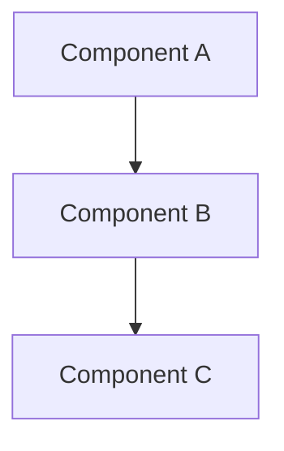
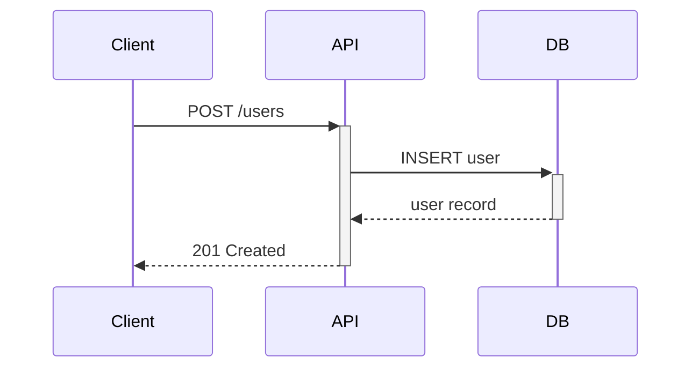
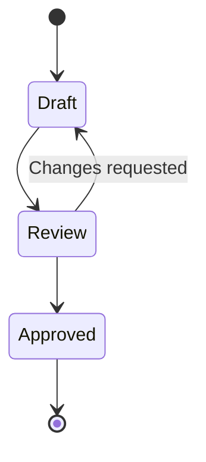
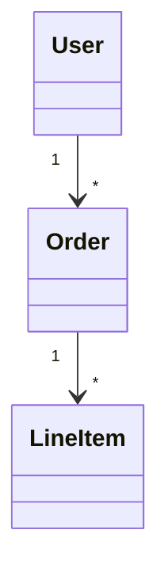
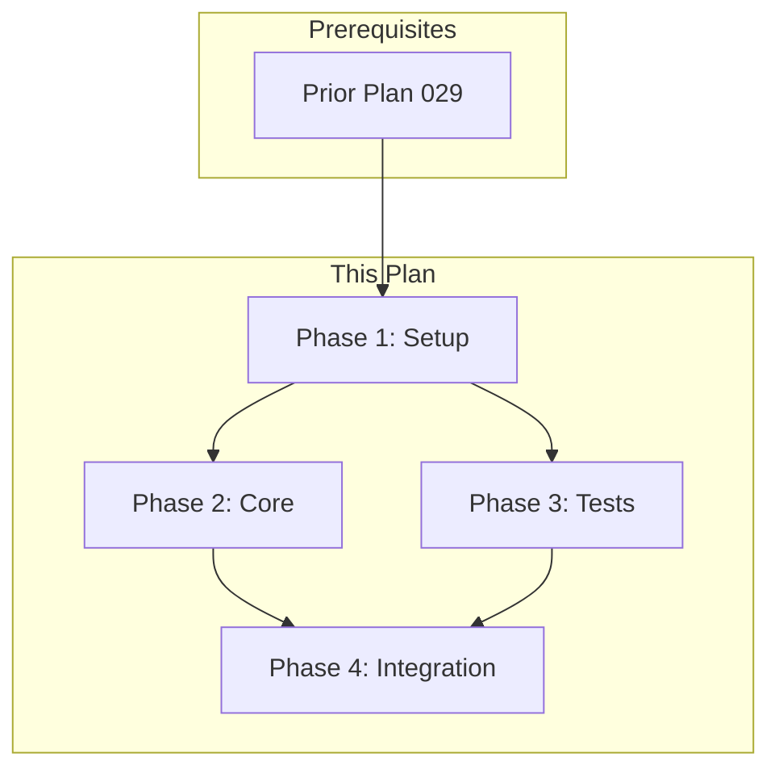

# Create Implementation Plan

Generate structured, executable implementation plans with visual diagrams and dependency tracking.

## Purpose

Transform requirements into actionable plans that:
- Stay under 5000 tokens (hard cap)
- Include visual diagrams (Mermaid or ASCII)
- Show task/subplan dependencies
- Are numbered sequentially in `docs/plans/`

## When to Use

- Before implementing a new feature
- When refactoring existing code
- For breaking down complex changes
- After brainstorming, before coding

## Critical Constraints

### Token Limit: Hard Cap 5000

- **Optimal:** 2000-3000 tokens (fits well in context with code)
- **Maximum:** 5000 tokens (STOP if exceeded)
- If plan would exceed 5000 tokens, create subplans instead
- Validate with: `bun run scripts/validate-plan.ts <plan-file>`

### Reference, Never Copy

- Reference docs by path only: `per docs/standards/validation.md`
- NEVER paste external content into the plan
- Only include directly relevant references

## Workflow

### Phase 1: Gather Requirements

**Ask clarifying questions before planning:**

1. **Scope**: What exactly should this feature do?
2. **Boundaries**: What's explicitly out of scope?
3. **Dependencies**: What existing code/systems does this touch?
4. **Constraints**: Any technical requirements or limitations?
5. **Success Criteria**: How do we know it's done?

Do NOT proceed until you have clear answers.

### Phase 2: Explore Codebase

Use the Explore subagent to understand:
- Existing modules and patterns
- Files that will need modification
- Dependencies and integration points
- Documentation that needs updates

### Phase 3: Design Architecture

Create diagrams to illustrate:
- Component relationships
- Data/control flow
- State transitions
- Interactions and sequences

Use Mermaid (preferred) or ASCII. Choose the diagram type that best fits:

**Flowchart** - Component relationships, data flow:


**Sequence** - API calls, interactions between systems:


**State** - Lifecycle, status transitions:


**Class** - Object relationships, data models:


**ASCII** - When Mermaid isn't rendered:
```
┌──────────────┐         ┌──────────────┐
│  Component A │ ──────► │  Component B │
└──────────────┘         └──────────────┘
```

### Phase 4: Plan Tasks

Break work into phases and tasks:
- Each task should be 2-15 minutes
- Include file paths (CREATE/MODIFY/DELETE)
- Add verification steps
- Include commit messages

### Phase 5: Check Size & Split

Before writing:
1. Estimate token count (~4 chars = 1 token)
2. If > 3000 tokens, consider splitting
3. If > 5000 tokens, MUST create subplans

**Subplan Strategy:**
```
030_feature-initiative.md      (parent overview)
├── 030A_frontend-component.md (subplan A)
├── 030B_backend-api.md        (subplan B)
└── 030C_integration.md        (subplan C)
```

### Phase 6: Define Testing Strategy

Every plan MUST include a testing strategy with:

1. **Automated Tests** (required)
   - Prefer E2E tests that validate the full feature flow
   - Include integration tests for component interactions
   - Add unit tests for complex logic

2. **Manual Validation** (required)
   - Step-by-step instructions for human verification
   - What to look for, what to click, what to expect
   - Screenshots or recordings if helpful

```markdown
## Testing Strategy

### Automated Tests

| Type | What It Tests | Command |
|------|---------------|---------|
| E2E | Full user flow | `bun test:e2e tests/e2e/feature.spec.ts` |
| Integration | API + DB | `bun test tests/integration/` |
| Unit | Core logic | `bun test tests/unit/` |

### Manual Validation

1. Navigate to /settings
2. Click "Preferences" tab
3. Toggle dark mode
4. **Expected:** Theme changes immediately
5. Refresh page
6. **Expected:** Setting persists
```

### Phase 7: Create Dependency Graph

Every plan MUST end with a dependency graph showing:
- Which tasks/subplans can run in parallel
- Which must be sequential
- External prerequisites



### Phase 8: Write Plan

Write to: `docs/plans/{NNNN}_{FEATURE_NAME}.md`

Use the template from [assets/plan-template.md](assets/plan-template.md).

### Phase 9: Validate

Run the validation script:
```bash
bun run content/skills/create-plan/scripts/validate-plan.ts docs/plans/{plan-file}.md
```

### Phase 10: Commit Plan

After validation passes, commit the plan and any related artifacts:

```bash
git add docs/plans/{plan-file}.md
git add docs/plans/{plan-file}*.md  # Include any subplans
git commit -m "docs(plan): add {NNNN}_{FEATURE_NAME}

- {Brief description of what the plan covers}
- Includes dependency graph and testing strategy

🤖 Generated with [Claude Code](https://claude.com/claude-code)

Co-Authored-By: Claude <noreply@anthropic.com>"
```

Always commit immediately after validation to ensure plans are tracked in version control.

### Phase 11: Offer Review

After committing, ask:
> "Would you like me to run `/review-plan` to validate this plan before implementation?"

The review-plan skill will:
- Check for completeness and clarity
- Validate dependencies are correct
- Ensure testing strategy is adequate
- Identify potential issues or gaps

### Phase 12: Offer Worktree Setup

After plan is complete, ask:
> "Would you like me to create a git worktree for implementing this plan?"

Worktrees are created in `.worktrees/` named after the plan:
```bash
git worktree add .worktrees/0042_user-preferences -b feature/0042_user-preferences
```

See [references/worktree-setup.md](references/worktree-setup.md) for details.

## Plan Numbering

1. Check `docs/plans/` for the highest existing plan number
2. Use the next sequential number
3. Format: `{NNNN}_{FEATURE_NAME}.md` (4 digits, zero-padded)

Examples:
- `0001_user-authentication.md`
- `0042_api-refactor.md`
- `0100_database-migration.md`

## Output Location

All plans go to: `docs/plans/`

```
docs/plans/
├── 0001_initial-setup.md
├── 0002_user-auth.md
├── 0003A_frontend-forms.md
├── 0003B_backend-validation.md
└── 0003C_integration-tests.md
```

## Plan Structure

See [assets/plan-template.md](assets/plan-template.md) for the full template.

Key sections:
1. **Header** - Status, overview, goals
2. **References** - Only directly relevant docs
3. **Architecture** - Mermaid/ASCII diagrams
4. **Phases** - Numbered tasks with prereqs
5. **Files Summary** - CREATE/MODIFY/DELETE table
6. **Testing Strategy** - Automated tests + manual validation (required)
7. **Dependency Graph** - Required at end
8. **Checklist** - Completion tracking

## Examples

See [references/examples.md](references/examples.md) for complete plan examples.

## Validation

Run validation before finalizing:
- Token count under 5000
- Testing strategy present (automated + manual)
- Dependency graph present
- Proper numbering format

## Related Skills

- `brainstorm` - Use before planning to explore ideas
- `review-plan` - Review a plan before execution
- `implement-plan` - Execute a plan task by task
