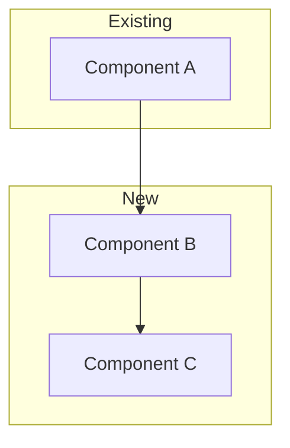
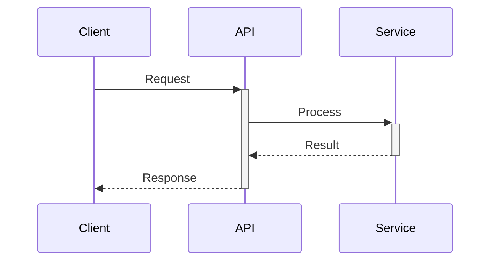
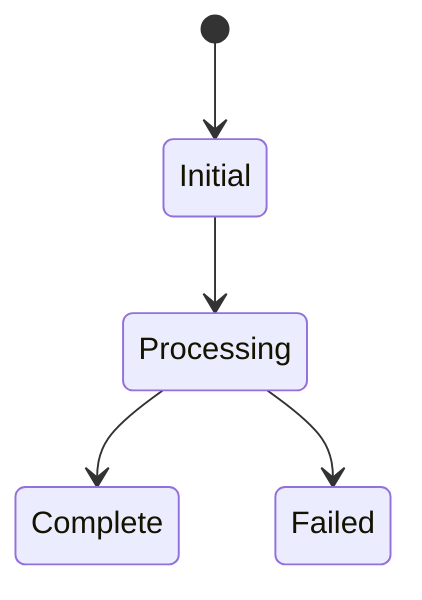
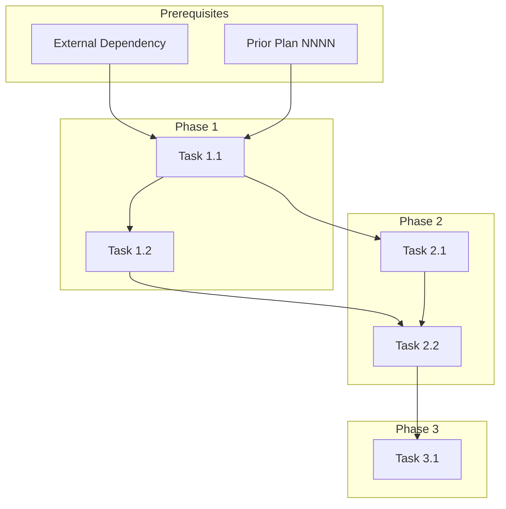

# Plan Template

Use this template when generating implementation plans.

---

````markdown
# {NNNN}_{FEATURE_NAME}

**Status:** DRAFT | IN_PROGRESS | COMPLETE | ABANDONED

---

## Overview

{2-3 sentences summarizing the feature and its value.}

**Related Plans:** {omit if none}
- `{NNNN}_{RELATED_PLAN}` - {brief description}

## Goals

1. {Primary goal}
2. {Secondary goal}
3. {Additional goals as needed}

## Non-Goals

{Explicitly list what this plan does NOT cover to prevent scope creep.}

- {Non-goal 1}
- {Non-goal 2}

## References

{ONLY include subsections that apply. Omit entirely if no references needed.}

**Standards:**
- `docs/standards/{file}.md` - {why it applies}

**Templates:**
- `docs/templates/{file}.md` - {why it applies}

**ADRs:**
- `docs/adrs/{file}.md` - {why it applies}

---

## Architecture

{Visual representation of the changes. Choose the diagram type that best fits.}

{Flowchart for component relationships:}


{Sequence diagram for API/interaction flows:}


{State diagram for lifecycle/status changes:}


{Or ASCII when Mermaid isn't rendered:}
```
┌──────────────┐         ┌──────────────┐
│  Component A │ ──────► │  Component B │
└──────────────┘         └──────────────┘
```

---

## Phase 1: {Phase Name}

**Prereqs:**
- {What must exist before this phase can start}
- {Files, tools, prior phases}

**Blockers:**
- {What's missing that will prevent completion}
- {Flag issues to resolve}

### 1.1 {Task Name}

**Files:**
- CREATE: `{path/to/NewFile.ts}`
- MODIFY: `{path/to/ExistingFile.ts}`
- DELETE: `{path/to/ObsoleteFile.ts}`

**Implementation:**

{Brief description of what to do. Include essential code snippets only.}

```typescript
// path/to/file.ts
export function example() {
  // implementation
}
```

**Verification:**

```bash
bun test path/to/test.ts
# Expected: All tests pass
```

**Commit:** `feat(scope): description`

---

### 1.2 {Next Task}

{Same structure as 1.1}

---

## Phase 2: {Phase Name}

{Same structure as Phase 1}

---

## Files Summary

| Action | File | Purpose |
|--------|------|---------|
| CREATE | `path/to/new.ts` | {purpose} |
| MODIFY | `path/to/existing.ts` | {purpose} |
| DELETE | `path/to/obsolete.ts` | {purpose} |

---

## Testing Strategy

{REQUIRED: Every plan must include both automated tests and manual validation steps.}

### Automated Tests

{Prefer E2E tests that validate the complete user flow.}

| Type | What It Tests | Command |
|------|---------------|---------|
| E2E | {Full user flow - PREFERRED} | `bun test:e2e tests/e2e/{feature}.spec.ts` |
| Integration | {API + database interactions} | `bun test tests/integration/{feature}/` |
| Unit | {Complex business logic} | `bun test tests/unit/{module}.test.ts` |

**E2E Test Example:**

```typescript
// tests/e2e/user-preferences.spec.ts
test('user can update and persist preferences', async ({ page }) => {
  await page.goto('/settings')
  await page.click('[data-testid="preferences-tab"]')
  await page.click('[data-testid="dark-mode-toggle"]')
  await expect(page.locator('body')).toHaveClass(/dark/)

  await page.reload()
  await expect(page.locator('body')).toHaveClass(/dark/)
})
```

### Manual Validation

{Step-by-step instructions for human verification.}

1. {Action}: Navigate to /settings
2. {Action}: Click the "Preferences" tab
3. {Action}: Toggle "Dark Mode" switch
4. **Expected:** Theme changes immediately, no page reload
5. {Action}: Refresh the browser
6. **Expected:** Dark mode setting persists
7. {Action}: Open browser dev tools → Application → Local Storage
8. **Expected:** `theme: "dark"` is stored

---

## Documentation Updates

| File | Update Required |
|------|-----------------|
| `CLAUDE.md` | {changes needed} |
| `README.md` | {changes needed} |
| `{module}/AGENTS.md` | {changes needed} |

{Omit this section if no documentation updates needed.}

---

## Dependency Graph

{REQUIRED: Show execution order and parallelization opportunities.}



**Parallel Opportunities:**
- Tasks 1.2 and 2.1 can run in parallel after Task 1.1
- {Other parallelization notes}

**Sequential Requirements:**
- Task 2.2 depends on both 1.2 and 2.1
- {Other sequential requirements}

---

## Rollback Plan

{How to undo if issues arise.}

```bash
# Revert commits
git revert {commit-range}

# Or reset to prior state
git reset --hard {prior-commit}
```

{Additional rollback notes if needed.}

---

## Checklist

- [ ] Phase 1 complete
- [ ] Phase 2 complete
- [ ] All tests passing
- [ ] Documentation updated
- [ ] Dependency graph verified
- [ ] Token count under 5000

---

*Plan created with agent-kit. Execute with `/implement-plan`.*
````

---

## Template Notes

### Required Sections

- Overview with status
- Goals
- Architecture diagram (Mermaid or ASCII)
- At least one Phase with tasks
- Files Summary
- Testing Strategy (automated tests + manual validation)
- Dependency Graph
- Checklist

### Optional Sections

- Related Plans
- Non-Goals
- References
- Documentation Updates
- Rollback Plan

### Token Guidelines

| Plan Size | Tokens | When to Use |
|-----------|--------|-------------|
| Small | 500-1500 | Simple features, bug fixes |
| Optimal | 2000-3000 | Standard features (best for context) |
| Large | 3000-5000 | Complex features |
| Split Required | >5000 | Create subplans |

**Why token limits?**
- Plans are loaded into context alongside code
- 2000-3000 tokens leaves room for implementation context
- Larger plans crowd out code visibility
- Estimate: ~4 characters = 1 token

### Subplan Naming

For large initiatives:
```
0030_feature-initiative.md     (parent with overview + dependency graph)
├── 0030A_subplan-one.md       (first independent piece)
├── 0030B_subplan-two.md       (second independent piece)
└── 0030C_integration.md       (ties them together)
```

Each subplan should:
- Stand alone and be mergeable independently
- Reference sibling plans in Related Plans
- Stay under 3000 tokens (optimal range)
