# Plan Examples

Real-world examples of well-structured implementation plans.

---

## Example 1: Small Plan (API Endpoint)

```markdown
# 0042_user-preferences-api

**Status:** DRAFT

---

## Overview

Add a REST endpoint to retrieve and update user preferences. This enables the settings UI to persist user choices.

## Goals

1. Create GET /api/users/{id}/preferences endpoint
2. Create PUT /api/users/{id}/preferences endpoint
3. Add validation for preference values

## Non-Goals

- Preference migration from legacy system
- Admin override of user preferences

---

## Architecture

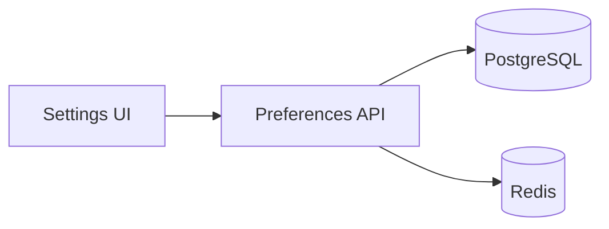

---

## Phase 1: Database & Model

**Prereqs:**
- PostgreSQL connection configured
- Existing User model

**Blockers:** None

### 1.1 Create Preferences Table

**Files:**
- CREATE: `src/db/migrations/042_user_preferences.sql`
- CREATE: `src/models/UserPreferences.ts`

**Implementation:**

```sql
-- 042_user_preferences.sql
CREATE TABLE user_preferences (
  user_id UUID PRIMARY KEY REFERENCES users(id),
  theme VARCHAR(20) DEFAULT 'system',
  notifications_enabled BOOLEAN DEFAULT true,
  updated_at TIMESTAMP DEFAULT NOW()
);
```

**Verification:**

```bash
bun run db:migrate
# Expected: Migration successful
```

**Commit:** `feat(db): add user_preferences table`

---

## Phase 2: API Endpoints

**Prereqs:**
- Phase 1 complete
- Auth middleware configured

### 2.1 GET Endpoint

**Files:**
- CREATE: `src/routes/preferences.ts`
- MODIFY: `src/routes/index.ts`

**Commit:** `feat(api): add GET /preferences endpoint`

### 2.2 PUT Endpoint

**Files:**
- MODIFY: `src/routes/preferences.ts`

**Commit:** `feat(api): add PUT /preferences endpoint`

---

## Files Summary

| Action | File | Purpose |
|--------|------|---------|
| CREATE | `src/db/migrations/042_user_preferences.sql` | Database schema |
| CREATE | `src/models/UserPreferences.ts` | Type definitions |
| CREATE | `src/routes/preferences.ts` | API handlers |
| MODIFY | `src/routes/index.ts` | Route registration |

---

## Dependency Graph

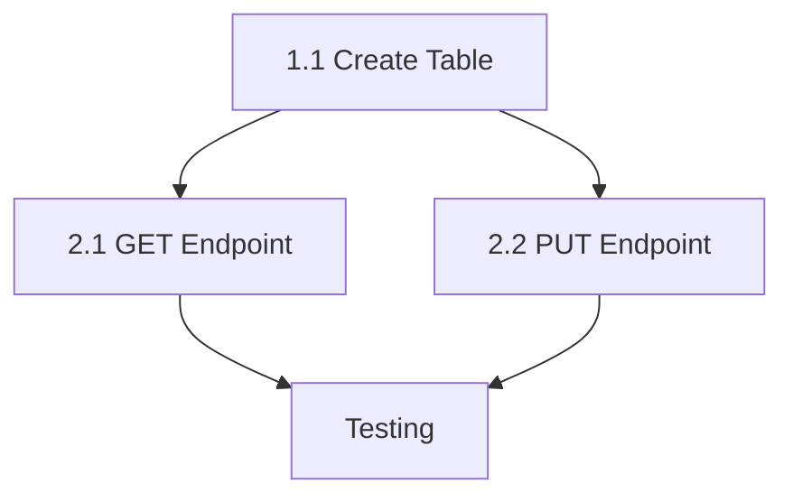

**Parallel Opportunities:**
- Tasks 2.1 and 2.2 can be developed in parallel after 1.1

---

## Checklist

- [ ] Phase 1 complete
- [ ] Phase 2 complete
- [ ] All tests passing
```

**Token count:** ~800 tokens (well within optimal range)

---

## Example 2: Medium Plan with Subplans (Feature Initiative)

```markdown
# 0050_notification-system

**Status:** DRAFT

---

## Overview

Implement a notification system with email, push, and in-app channels. Due to scope, this is split into subplans.

## Goals

1. Create notification service core
2. Implement email channel
3. Implement push notification channel
4. Implement in-app notification channel
5. Add user preference controls

## Related Plans

- `0050A_notification-core.md` - Service infrastructure
- `0050B_email-channel.md` - Email notifications
- `0050C_push-channel.md` - Push notifications
- `0050D_inapp-channel.md` - In-app notifications

---

## Architecture

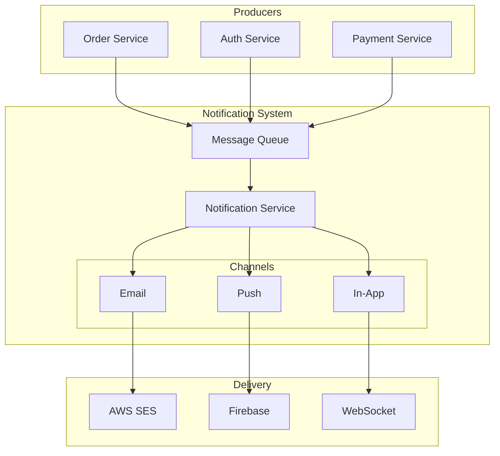

---

## Subplan Dependency Graph

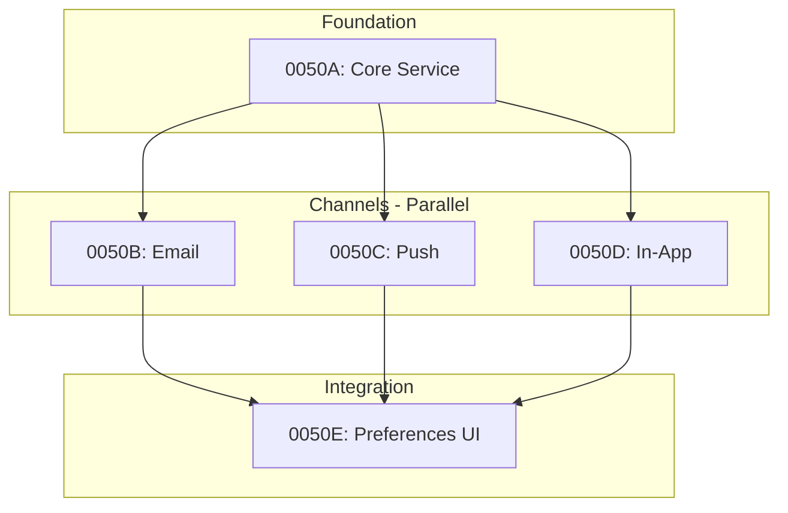

**Parallel Opportunities:**
- Subplans B, C, D can be developed in parallel after A completes
- Each channel subplan is independently mergeable

**Sequential Requirements:**
- Core (A) must complete before any channel
- Preferences UI (E) requires all channels complete

---

## Checklist

- [ ] 0050A complete and merged
- [ ] 0050B complete and merged
- [ ] 0050C complete and merged
- [ ] 0050D complete and merged
- [ ] 0050E complete and merged
- [ ] Integration testing complete
```

**Token count:** ~700 tokens (parent plan only, subplans add ~2000 each)

---

## Example 3: Diagram Types

Choose the diagram type that best illustrates your changes.

### Sequence Diagram (API Flows)

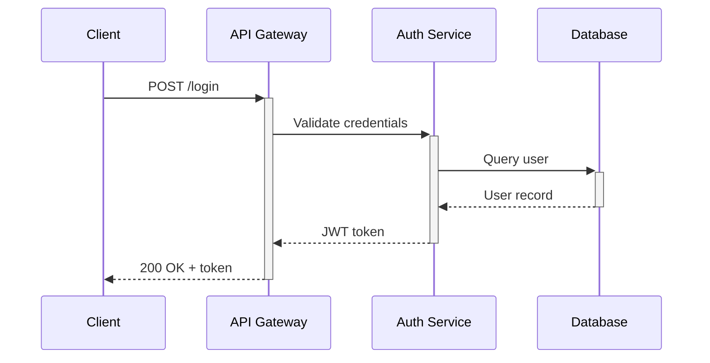

Best for: API interactions, authentication flows, request/response patterns.

### State Diagram (Lifecycle)

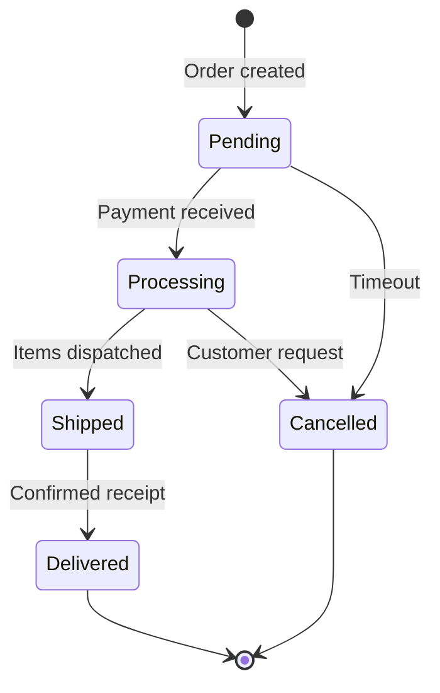

Best for: Order status, workflow states, entity lifecycle.

### Class Diagram (Data Models)

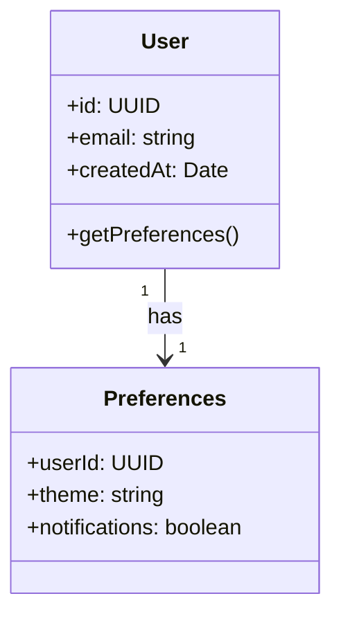

Best for: Entity relationships, data models, type hierarchies.

### ER Diagram (Database Schema)

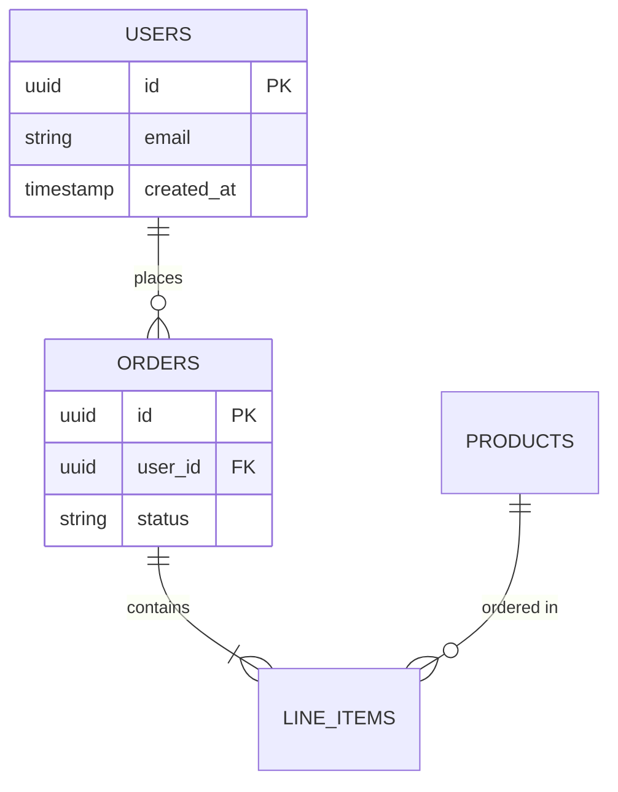

Best for: Database design, foreign key relationships.

---

## Example 4: Task Dependency Patterns

### Linear Dependencies

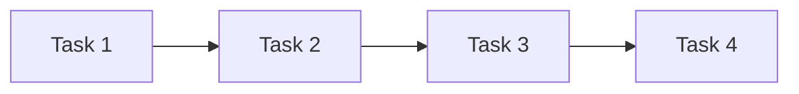

Use when each task depends on the previous.

### Parallel with Sync Point

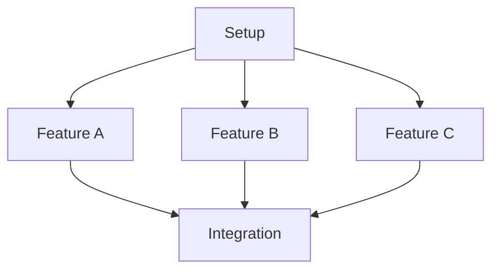

Use when multiple independent features can be developed simultaneously.

### Diamond Pattern

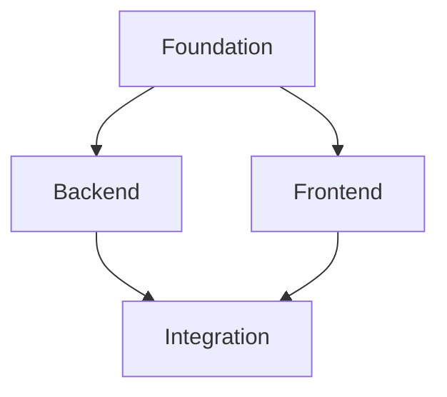

Common for full-stack features.

### Complex with External Dependencies

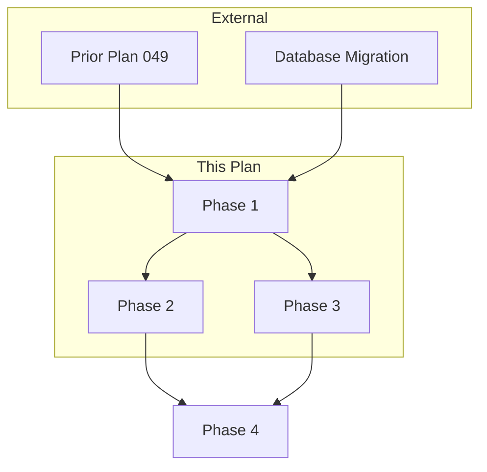

Use when plan depends on external work.

---

## Anti-Patterns to Avoid

### Too Vague

```markdown
## Phase 1: Setup

Do the initial setup work.
```

**Better:**

```markdown
## Phase 1: Database Setup

**Prereqs:**
- PostgreSQL 15+ installed
- Database credentials in .env

### 1.1 Create Migration

**Files:**
- CREATE: `src/db/migrations/001_initial.sql`

**Implementation:**
{specific SQL}
```

### Missing Dependencies

```markdown
## Phase 2: API

Build the API endpoints.

## Phase 3: Frontend

Build the UI components.
```

**Better:**

```markdown
## Dependency Graph

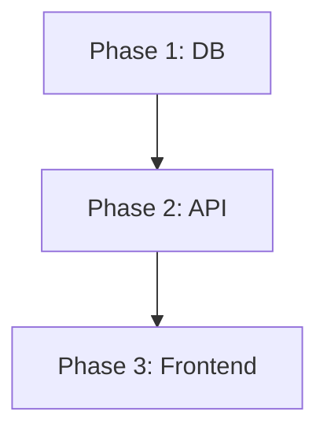

### No Verification Steps

```markdown
### 1.1 Add validation

Add input validation to the form.

**Commit:** `feat: add validation`
```

**Better:**

```markdown
### 1.1 Add Form Validation

**Files:**
- MODIFY: `src/components/Form.tsx`

**Implementation:**
{code}

**Verification:**

```bash
bun test src/components/Form.test.tsx
# Expected: 5 tests passing
```

**Commit:** `feat(form): add input validation`
```
