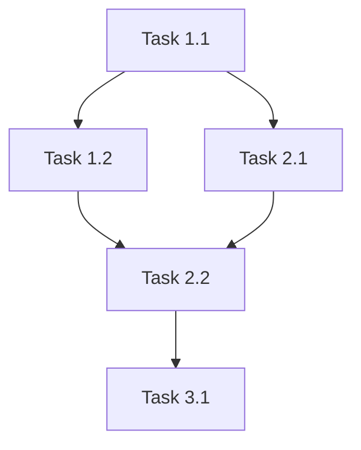

# Execute Implementation Plan

Autonomously execute implementation plans with verification checkpoints and subagent delegation.

## Purpose

Transform approved plans into working code through:
- Subagent-driven parallel execution
- Dependency graph-based task ordering
- Continuous verification at each phase
- Mandatory review-implementation checkpoints

## When to Use

- After a plan passes review-plan validation
- When implementing features from docs/plans/
- For autonomous execution of multi-phase work

## Execution Modes

### Autonomous Mode (Default)

Executes continuously with minimal interruption. Check-ins only for:
- Blocking errors that require user input
- Security-sensitive operations
- Ambiguous requirements discovered during implementation

### Interactive Mode

Request with: "execute with frequent check-ins" or "execute interactively"

Pauses after each phase for user approval before continuing.

## Pre-Execution Workflow

### Step 1: Locate the Plan

**If plan path provided:** Use directly.

**If no path:**
1. Check conversation context for recent plan
2. List `docs/plans/` for available plans
3. Ask user which plan to execute

### Step 2: Run Baseline Tests

Before ANY implementation work, verify current test state:

```bash
bun test
```

**If tests fail:**
```
⚠️ BASELINE TEST FAILURE

Found {N} failing tests before starting implementation.
This indicates pre-existing issues in the codebase.

Options:
1. Proceed anyway (failures may compound)
2. Fix failing tests first
3. Abort execution

How would you like to proceed?
```

**STOP and wait for user confirmation if tests fail.**

### Step 3: Sanity Check Plan

Before execution, validate the plan against the current codebase:

1. **Explore referenced files** - Do they exist? Are paths correct?
2. **Check dependencies** - Are prerequisite plans completed?
3. **Verify assumptions** - Does the architecture match plan expectations?
4. **Review blockers** - Are any blockers listed still unresolved?

If discrepancies found:

```markdown
## Plan Sanity Check: {plan-name}

**Status:** NEEDS_ATTENTION

### Discrepancies Found

| Issue | Plan Says | Codebase Shows | Severity |
|-------|-----------|----------------|----------|
| Missing file | MODIFY `src/foo.ts` | File doesn't exist | HIGH |
| Wrong path | `lib/utils.ts` | Actually at `src/lib/utils.ts` | MEDIUM |

### Recommendation
{Suggest updating plan or adjusting approach}

Should I proceed with adjustments, or would you like to update the plan first?
```

### Step 4: Parse Dependency Graph

Extract the dependency graph from the plan:

1. Identify all tasks and their IDs
2. Build adjacency list of dependencies
3. Compute execution order using topological sort
4. Identify parallelization opportunities



**Execution Order:** T1 → (T2 || T3) → T4 → T5

## Execution Workflow

### For Each Phase

1. **Announce Phase Start**
   ```
   ## Executing Phase {N}: {Phase Name}

   Tasks: {list of tasks}
   Dependencies: {what must complete first}
   ```

2. **Execute Tasks via Subagents**
   - Launch Task agents for parallelizable work
   - Use Explore agents for context gathering
   - Coordinate dependencies between agents

3. **Verify Each Task**
   After completing each task:
   - Run specified verification command
   - Check file changes match expectations
   - Validate no regressions introduced

4. **Commit Incrementally**
   Use commit messages specified in the plan:
   ```bash
   git add {files}
   git commit -m "{message from plan}"
   ```

### Subagent Strategy

**Use Task agents for:**
- Independent implementation tasks
- Test writing (can parallelize with implementation)
- Documentation updates

**Use Explore agents for:**
- Gathering context about existing code
- Understanding patterns before implementation
- Validating assumptions

**Sequential execution required for:**
- Tasks with explicit dependencies
- Tasks modifying the same files
- Integration work that depends on prior tasks

### Phase Completion Checkpoint

After EACH phase completes, invoke `review-implementation`:

```
/review-implementation --scope phase --phase {N}
```

**Process the review feedback:**

1. **If PASS:** Continue to next phase
2. **If NEEDS_REVISION:**
   - Analyze the specific issues raised
   - Apply fixes if clearly needed
   - Re-run verification
   - Re-invoke review-implementation
3. **If FAIL:**
   - Stop execution
   - Present issues to user
   - Ask how to proceed

**Critical Analysis of Feedback:**

Do NOT blindly apply all suggestions. Evaluate each:
- Is this a valid concern or false positive?
- Does fixing this introduce other issues?
- Is this within scope of the current task?

Document decisions in commit messages when choosing not to apply feedback.

## Verification Protocol

### After Each Task

```bash
# Run task-specific verification from plan
{verification_command}

# Run affected tests
bun test {affected_test_files}
```

### After Each Phase

```bash
# Full test suite
bun test

# Type check
bun run typecheck

# Lint
bun run lint
```

### Test Failure Handling

If tests fail during execution:

1. **Identify the failure**
   - New test failing (likely implementation bug)
   - Existing test failing (regression introduced)

2. **For new test failures:**
   - Review implementation against spec
   - Fix the code, not the test (unless test is wrong)

3. **For regressions:**
   - Stop and analyze
   - Check if change is intentional
   - If intentional, update test
   - If unintentional, fix the regression

## Plan Completion

When ALL phases complete:

### Step 1: Final Verification

```bash
bun test
bun run typecheck
bun run lint
bun run build  # if applicable
```

### Step 2: Verify All Tasks Complete

**REQUIRED:** Before proceeding, verify every task in the plan is complete.

Scan the plan for:
1. **Phase tasks** - All `### X.Y {Task Name}` sections
2. **Checklist items** - All `- [ ]` items in the Checklist section
3. **Files Summary** - All CREATE/MODIFY/DELETE actions

For each item, verify:
- Task was executed
- Verification command passed
- Expected files exist/changed

**If incomplete items found:**

```markdown
## Incomplete Tasks Detected

The following items in the plan are not yet complete:

### Incomplete Tasks
| Task | Status | Reason |
|------|--------|--------|
| 2.3 Add validation | ❌ Not executed | Skipped during phase 2 |
| 3.1 Write E2E tests | ❌ Partial | Only 2 of 4 tests written |

### Unchecked Checklist Items
- [ ] Documentation updated
- [ ] E2E tests passing

### Missing File Operations
| Action | File | Status |
|--------|------|--------|
| CREATE | `src/validators/email.ts` | ❌ Not created |

---

**Options:**
1. Complete the remaining tasks now
2. Mark tasks as intentionally skipped (with reason)
3. Abort and leave plan as IN_PROGRESS

How would you like to proceed?
```

**STOP and wait for user guidance if any tasks are incomplete.**

Only proceed to the final review when ALL tasks are verified complete or explicitly marked as skipped with user approval.

### Step 3: Mandatory Final Review

**REQUIRED:** Invoke review-implementation for the complete plan:

```
/review-implementation --scope plan
```

This validates:
- All tasks completed per spec
- Tests provide adequate coverage
- No regressions introduced
- Documentation updated if required

### Step 4: Update Plan Status

Mark the plan as complete:

```markdown
**Status:** COMPLETE
```

Update the checklist in the plan file (mark all items as `[x]`).

### Step 5: Summary Report

```markdown
## Execution Complete: {plan-name}

**Status:** ✅ SUCCESS

### Phases Executed
- [x] Phase 1: {name} - {N} tasks
- [x] Phase 2: {name} - {N} tasks

### Files Changed
| Action | Count |
|--------|-------|
| Created | {N} |
| Modified | {N} |
| Deleted | {N} |

### Tests
- Added: {N} new tests
- All tests passing: ✅

### Reviews
- Phase checkpoints: {N} passed
- Final review: PASS

### Commits
{list of commits created}
```

### Step 6: Invoke Archive

After successful completion, invoke `merge-archive-plan`:

```bash
# Check current branch
git branch --show-current
```

**If on feature branch/worktree:**
```
Plan execution complete on feature branch.

The plan will be archived after the PR is merged to main.
Use `/ak-merge-archive-plan` after merge to archive with full metadata.
```

Skip archiving - wait for PR merge.

**If on main branch:**

Prompt user for confirmation:

```
Plan execution complete on main branch.

Would you like to archive this plan now?
- The plan will be moved to docs/plans/archive/
- Archive metadata will be added (commits, files, lessons learned)

[Yes] [No, I'll do it later]
```

If user confirms, invoke:
```
/ak-merge-archive-plan {plan-path}
```

## Error Handling

### Blocking Errors

Stop and ask for guidance when:
- Required file doesn't exist
- External dependency unavailable
- Ambiguous requirement discovered
- Security concern identified

### Recoverable Errors

Handle automatically:
- Minor path corrections
- Import statement fixes
- Linting issues (auto-fix)
- Type inference adjustments

### Rollback

If execution must be aborted:

```bash
# Show user the rollback command
git log --oneline --since="execution start"

# Suggest rollback
git reset --hard {pre-execution-commit}
```

## Examples

### Example: Execute a plan autonomously

```
User: Execute docs/plans/0042_user-auth.md

Claude: [Runs baseline tests - all pass]
[Performs sanity check - plan matches codebase]
[Parses dependency graph]

Starting autonomous execution of 0042_user-auth

## Executing Phase 1: Database Schema

[Launches subagents for parallel tasks]
[Completes Task 1.1, 1.2]
[Runs verification]
[Invokes /review-implementation --scope phase --phase 1]
[Review: PASS]

## Executing Phase 2: API Endpoints
...

[Continues through all phases]
[Invokes /review-implementation --scope plan]

## Execution Complete: 0042_user-auth

All phases executed successfully.
```

### Example: Plan with failing baseline

```
User: /plan-execute docs/plans/0015_feature.md

Claude: Running baseline tests...

⚠️ BASELINE TEST FAILURE

Found 3 failing tests before starting implementation:
- tests/unit/parser.test.ts (2 failures)
- tests/integration/api.test.ts (1 failure)

Options:
1. Proceed anyway (failures may compound)
2. Fix failing tests first
3. Abort execution

How would you like to proceed?
```

### Example: Interactive mode

```
User: Execute the plan with frequent check-ins

Claude: [Running in interactive mode]

## Phase 1 Complete

Tasks completed:
- 1.1 Create schema file ✅
- 1.2 Add migration ✅

Verification: All tests passing

Ready to proceed to Phase 2: API Endpoints?
```

## Related Skills

- `create-plan` - Creates plans this skill executes
- `review-plan` - Validates plans before execution
- `review-implementation` - Checkpoint reviews during execution
- `merge-archive-plan` - Archives plans after completion
