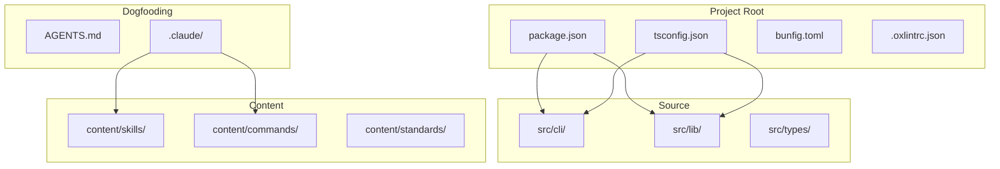
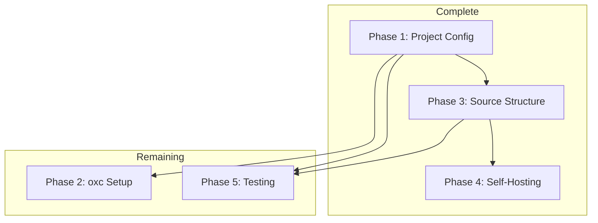

# 0001_bootstrap

**Status:** IN_PROGRESS

---

## Overview

Set up the project structure, tooling, and migrate content from agent-tool-kit. This is the foundation for all subsequent development.

**Related Plans:**
- `0002_cli-core` - CLI implementation that builds on this foundation

## Goals

1. Initialize Bun project with TypeScript
2. Configure linting (oxlint) and formatting (oxfmt)
3. Create source directory structure
4. Set up self-hosting (dogfooding)
5. Add high-value tests for critical modules

## Non-Goals

- Full skill migration (handled separately)
- CLI implementation (see 0002_cli-core)
- Content templates directory

## References

**External:**
- https://oxc.rs/docs - oxlint and oxfmt documentation

---

## Architecture



---

## Phase 1: Project Configuration

**Prereqs:** Bun installed
**Blockers:** None

**Status:** COMPLETE

### 1.1 Package and TypeScript Config

**Files:**
- CREATE: `package.json` - DONE
- CREATE: `tsconfig.json` - DONE

**Verification:** Files exist with correct configuration.

**Commit:** `chore: initialize bun project with TypeScript`

---

## Phase 2: Linting and Formatting

**Prereqs:** Phase 1 complete
**Blockers:** None

**Status:** PENDING

### 2.1 Replace ESLint/Prettier with oxc

**Files:**
- DELETE: ESLint config (if exists)
- DELETE: Prettier config (if exists)
- CREATE: `.oxlintrc.json`
- MODIFY: `package.json` - Update scripts

**Implementation:**

```json
// .oxlintrc.json
{
  "$schema": "https://raw.githubusercontent.com/oxc-project/oxc/main/npm/oxlint/configuration_schema.json",
  "rules": {
    "no-unused-vars": "warn",
    "no-console": "off"
  }
}
```

Update package.json scripts:
```json
{
  "scripts": {
    "lint": "oxlint",
    "lint:fix": "oxlint --fix",
    "format": "oxfmt .",
    "format:check": "oxfmt --check ."
  },
  "devDependencies": {
    "oxlint": "^0.16.0",
    "oxfmt": "^0.1.0"
  }
}
```

**Verification:**

```bash
bun add -D oxlint@^0.16.0 oxfmt@^0.1.0
bun run lint
bun run format:check
```

**Commit:** `chore: migrate from eslint/prettier to oxc`

### 2.2 Create bunfig.toml

**Files:**
- CREATE: `bunfig.toml`

**Implementation:**

```toml
[install]
peer = false

[test]
coverage = true
coverageDir = "./coverage"
```

**Verification:**

```bash
cat bunfig.toml
bun test --coverage  # Should use coverageDir
```

**Commit:** `chore: add bunfig.toml`

---

## Phase 3: Source Structure

**Prereqs:** Phase 1 complete
**Blockers:** None

**Status:** COMPLETE

### 3.1 CLI, Lib, and Types Directories

**Files:**
- CREATE: `src/cli/index.ts` - DONE
- CREATE: `src/lib/index.ts` - DONE
- CREATE: `src/types/index.ts` - DONE

All source directories exist with proper exports.

---

## Phase 4: Self-Hosting Setup

**Prereqs:** Content directories exist
**Blockers:** None

**Status:** COMPLETE

### 4.1 Dogfooding Configuration

**Files:**
- CREATE: `AGENTS.md` - DONE
- CREATE: `.claude/settings.json` - DONE
- CREATE: `.claude/skills` symlink - DONE
- CREATE: `.claude/commands` symlink - DONE

All dogfooding setup complete.

---

## Phase 5: Testing Foundation

**Prereqs:** Source structure complete
**Blockers:** None

**Status:** PENDING

### 5.1 Create Test Structure and High-Value Tests

**Files:**
- CREATE: `tests/lib/config.test.ts`
- CREATE: `tests/setup.test.ts`

**Implementation:**

```typescript
// tests/lib/config.test.ts
import { describe, it, expect, beforeEach, afterEach } from 'bun:test'
import { mkdtempSync, rmSync } from 'fs'
import { join } from 'path'
import { tmpdir } from 'os'
import { loadConfig, saveConfig, DEFAULT_CONFIG } from '../../src/lib/config'

describe('Config', () => {
  let tempDir: string

  beforeEach(() => {
    tempDir = mkdtempSync(join(tmpdir(), 'ak-test-'))
  })

  afterEach(() => {
    rmSync(tempDir, { recursive: true })
  })

  it('returns null when no config exists', () => {
    expect(loadConfig(tempDir)).toBeNull()
  })

  it('saves and loads config', () => {
    saveConfig(DEFAULT_CONFIG, tempDir)
    const loaded = loadConfig(tempDir)
    expect(loaded).toEqual(DEFAULT_CONFIG)
  })
})
```

```typescript
// tests/setup.test.ts
import { describe, it, expect } from 'bun:test'
import { existsSync } from 'fs'

describe('Project Setup', () => {
  it('has required config files', () => {
    expect(existsSync('package.json')).toBe(true)
    expect(existsSync('tsconfig.json')).toBe(true)
  })

  it('has source directories', () => {
    expect(existsSync('src/cli')).toBe(true)
    expect(existsSync('src/lib')).toBe(true)
    expect(existsSync('src/types')).toBe(true)
  })

  it('has dogfooding setup', () => {
    expect(existsSync('AGENTS.md')).toBe(true)
    expect(existsSync('.claude/settings.json')).toBe(true)
  })
})
```

**Verification:**

```bash
bun test tests/
# Expected: All tests pass
```

**Commit:** `test: add config and setup tests`

---

## Files Summary

| Action | File | Purpose |
|--------|------|---------|
| CREATE | `.oxlintrc.json` | Linting config |
| CREATE | `bunfig.toml` | Bun runtime config |
| CREATE | `tests/lib/config.test.ts` | Config module tests |
| CREATE | `tests/setup.test.ts` | Project structure tests |
| MODIFY | `package.json` | oxc scripts + deps |
| DELETE | ESLint/Prettier configs | Replace with oxc |

---

## Testing Strategy

### Automated Tests

| Type | What It Tests | Command |
|------|---------------|---------|
| Unit | Config load/save | `bun test tests/lib/config.test.ts` |
| Unit | Project structure | `bun test tests/setup.test.ts` |

### Manual Validation

1. Run `bun run lint` - should complete without errors
2. Run `bun run format:check` - should pass
3. Run `bun test` - all tests pass
4. Run `bun run typecheck` - no type errors

---

## Dependency Graph



**Parallel Opportunities:**
- Phase 2 and Phase 5 can run in parallel

**Sequential Requirements:**
- Phase 1 must complete before Phase 2, 3, 5
- Phase 3 before Phase 4

---

## Checklist

- [x] Phase 1 complete (project config)
- [ ] Phase 2 complete (oxc setup)
- [x] Phase 3 complete (source structure)
- [x] Phase 4 complete (self-hosting)
- [ ] Phase 5 complete (testing)
- [ ] All tests passing
- [ ] Linting passing

---

*Plan created with agent-kit. Execute with `/implement-plan`.*
