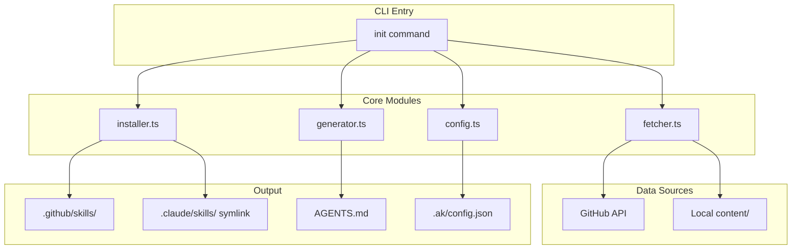
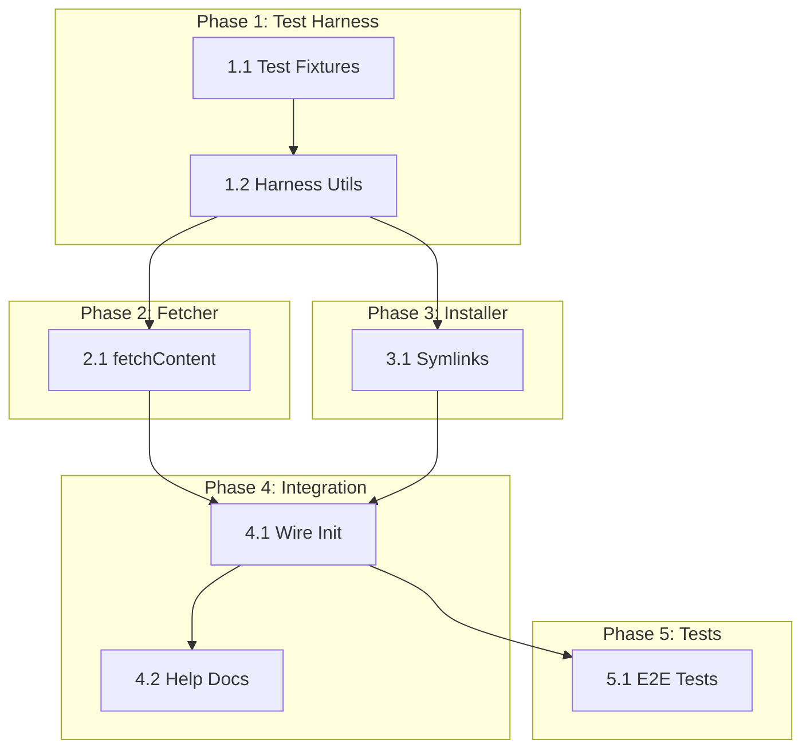

# 0003_init-command

**Status:** DRAFT

---

## Overview

Implement the minimal viable `ak init` command that installs skills from GitHub (or local content/ for testing), creates necessary directories, generates AGENTS.md, and saves configuration. Includes a test harness with setup/teardown for repeatable testing.

**Related Plans:**
- `0002_cli-core` - CLI foundation this builds on

## Goals

1. Complete `fetchContent()` to fetch skills from GitHub or local directory
2. Complete `installSkills()` with symlink creation for Claude Code
3. Wire init command to call fetcher, installer, and generator
4. Create test harness with setup/teardown scripts for repeatable testing
5. Add `--local` flag for development/testing mode

## Non-Goals

- Custom preset creation (future plan)
- Delegation configuration (future plan)
- Command installation (skills only for MVP)
- Interactive preset selection (use flags only)

---

## Architecture



---

## Phase 1: Test Harness

**Prereqs:** None
**Blockers:** None

### 1.1 Create Test Fixtures Directory

**Files:**
- CREATE: `tests/fixtures/skills/test-skill/SKILL.md`
- CREATE: `tests/fixtures/README.md`

**Implementation:**

Create minimal test fixtures that mirror the content/ structure:

```typescript
// tests/fixtures/skills/test-skill/SKILL.md
---
name: test-skill
description: A test skill for automated testing
license: MIT
metadata:
  author: test
  version: "1.0.0"
---

# Test Skill

This is a test skill used for automated testing.
```

**Verification:**

```bash
ls tests/fixtures/skills/test-skill/SKILL.md
```

**Commit:** `test: add test fixtures for init command`

### 1.2 Create Test Harness Utilities

**Files:**
- CREATE: `tests/helpers/harness.ts`

**Implementation:**

```typescript
// tests/helpers/harness.ts
import { mkdirSync, rmSync, existsSync } from 'fs'
import { join } from 'path'

const TEST_DIR = './test-output'

export function setupTestDir(): string {
  if (existsSync(TEST_DIR)) {
    rmSync(TEST_DIR, { recursive: true })
  }
  mkdirSync(TEST_DIR, { recursive: true })
  return TEST_DIR
}

export function teardownTestDir(): void {
  if (existsSync(TEST_DIR)) {
    rmSync(TEST_DIR, { recursive: true })
  }
}

export function getTestDir(): string {
  return TEST_DIR
}
```

**Verification:**

```bash
bun test tests/helpers/harness.test.ts
```

**Commit:** `test: add test harness utilities`

---

## Phase 2: Fetcher Implementation

**Prereqs:** Test harness
**Blockers:** None

### 2.1 Implement fetchContent with Local Support

**Files:**
- MODIFY: `src/lib/fetcher.ts`
- CREATE: `tests/lib/fetcher.test.ts`

**Implementation:**

Add `useLocal` option to `FetchOptions` and implement directory scanning:

```typescript
export interface FetchOptions {
  repo: string
  branch: string
  path: string
  useLocal?: boolean  // Use local content/ directory
  localPath?: string  // Override local path (for testing)
}

export async function fetchContent(options: FetchOptions): Promise<{
  skills: Skill[]
  commands: Command[]
}> {
  if (options.useLocal) {
    return fetchLocalContent(options.localPath || 'content')
  }
  return fetchGitHubContent(options)
}

async function fetchLocalContent(basePath: string): Promise<...> {
  const skillsPath = join(basePath, 'skills')
  const skillDirs = readdirSync(skillsPath, { withFileTypes: true })
    .filter(d => d.isDirectory())
    .map(d => d.name)

  const skills: Skill[] = []
  for (const name of skillDirs) {
    const skillMd = readFileSync(join(skillsPath, name, 'SKILL.md'), 'utf-8')
    skills.push(parseSkillMd(skillMd))
  }

  return { skills, commands: [] }
}
```

**Verification:**

```bash
bun test tests/lib/fetcher.test.ts
# Expected: Tests for parseSkillMd, fetchLocalContent, fetchGitHubContent
```

**Commit:** `feat(lib): implement fetchContent with local support`

---

## Phase 3: Installer Completion

**Prereqs:** Fetcher working
**Blockers:** None

### 3.1 Add Symlink Creation

**Files:**
- MODIFY: `src/lib/installer.ts`
- CREATE: `tests/lib/installer.test.ts`

**Implementation:**

Complete the TODO for symlink creation:

```typescript
// After creating .github/skills/{name}/SKILL.md
// Create symlink from .claude/skills/{name} -> .github/skills/{name}
const claudeSkillPath = join(cwd, '.claude/skills', skill.name)
const githubSkillPath = join(cwd, '.github/skills', skill.name)

// Use relative path for symlink portability
const relativePath = relative(dirname(claudeSkillPath), githubSkillPath)
symlinkSync(relativePath, claudeSkillPath)
```

**Verification:**

```bash
bun test tests/lib/installer.test.ts
# Expected: Tests for directory creation, SKILL.md writing, symlink creation
```

**Commit:** `feat(lib): add symlink creation to installer`

---

## Phase 4: Init Command Integration

**Prereqs:** Fetcher and Installer complete
**Blockers:** None

### 4.1 Wire Up Init Command

**Files:**
- MODIFY: `src/cli/commands/init.ts`

**Implementation:**

Replace the stub with actual implementation:

```typescript
export async function initCommand(args: ParsedArgs): Promise<void> {
  const cwd = process.cwd()
  const useLocal = args.flags.local === true

  // ... existing preset validation ...

  print(`${symbols.info} Fetching skills...`)
  const { skills } = await fetchContent({
    repo: DEFAULT_CONFIG.source.repo,
    branch: DEFAULT_CONFIG.source.branch,
    path: DEFAULT_CONFIG.source.path,
    useLocal,
  })
  print(format.success(`Found ${skills.length} skills`))

  print(`${symbols.info} Installing skills...`)
  await installSkills({ cwd, config: DEFAULT_CONFIG, skills, commands: [] })
  print(format.success('Skills installed'))

  print(`${symbols.info} Generating AGENTS.md...`)
  generateAgentsMd(cwd, DEFAULT_CONFIG, skills)
  print(format.success('Created AGENTS.md'))

  saveConfig(DEFAULT_CONFIG, cwd)
  print(format.success('Created .ak/config.json'))

  // Success box
  printBox('agent-kit initialized!', [...])
}
```

**Verification:**

```bash
bun test tests/cli/init.test.ts
```

**Commit:** `feat(cli): wire up init command`

### 4.2 Add --local Flag to Help

**Files:**
- MODIFY: `src/cli/commands/help.ts`

**Implementation:**

Add `--local` flag to init command help:

```typescript
"--local": "Use local content/ directory instead of GitHub (for development)"
```

**Verification:**

```bash
bun run src/cli/index.ts help init | grep -q "local"
```

**Commit:** `docs(cli): add --local flag to init help`

---

## Phase 5: Integration Tests

**Prereqs:** All modules complete
**Blockers:** None

### 5.1 Create E2E Init Test

**Files:**
- CREATE: `tests/cli/init.test.ts`

**Implementation:**

```typescript
describe('Init Command', () => {
  beforeEach(() => setupTestDir())
  afterEach(() => teardownTestDir())

  it('initializes with --local flag', async () => {
    const cwd = getTestDir()
    process.chdir(cwd)

    await initCommand({
      command: 'init',
      flags: { yes: true, local: true },
      positional: []
    })

    expect(existsSync(join(cwd, '.github/skills'))).toBe(true)
    expect(existsSync(join(cwd, '.claude/skills'))).toBe(true)
    expect(existsSync(join(cwd, 'AGENTS.md'))).toBe(true)
    expect(existsSync(join(cwd, '.ak/config.json'))).toBe(true)
  })

  it('creates symlinks from .claude to .github', async () => {
    // ... test symlink creation
  })
})
```

**Verification:**

```bash
bun test tests/cli/init.test.ts
```

**Commit:** `test(cli): add init command integration tests`

---

## Files Summary

| Action | File | Purpose |
|--------|------|---------|
| CREATE | `tests/fixtures/skills/test-skill/SKILL.md` | Test fixture |
| CREATE | `tests/fixtures/README.md` | Fixtures documentation |
| CREATE | `tests/helpers/harness.ts` | Test setup/teardown |
| CREATE | `tests/lib/fetcher.test.ts` | Fetcher unit tests |
| CREATE | `tests/lib/installer.test.ts` | Installer unit tests |
| CREATE | `tests/cli/init.test.ts` | Init integration tests |
| MODIFY | `src/lib/fetcher.ts` | Add fetchContent implementation |
| MODIFY | `src/lib/installer.ts` | Add symlink creation |
| MODIFY | `src/cli/commands/init.ts` | Wire up modules |
| MODIFY | `src/cli/commands/help.ts` | Add --local flag docs |

---

## Testing Strategy

### Automated Tests

| Type | What It Tests | Command |
|------|---------------|---------|
| Unit | Fetcher parseSkillMd, fetchContent | `bun test tests/lib/fetcher.test.ts` |
| Unit | Installer directory creation, symlinks | `bun test tests/lib/installer.test.ts` |
| Integration | Full init command flow | `bun test tests/cli/init.test.ts` |

### Manual Validation

1. Create a test directory: `mkdir /tmp/test-init && cd /tmp/test-init`
2. Run: `bun run /path/to/agent-kit/src/cli/index.ts init --local --yes`
3. **Expected:** Success message with skill count
4. Verify: `ls -la .github/skills/` shows skill directories
5. Verify: `ls -la .claude/skills/` shows symlinks pointing to .github
6. Verify: `cat AGENTS.md` includes skill list
7. Verify: `cat .ak/config.json` has proper config
8. Run again without --force: **Expected:** "already initialized" warning

---

## Dependency Graph



**Parallel Opportunities:**
- Phase 2 (Fetcher) and Phase 3 (Installer) can run in parallel after Phase 1

**Sequential Requirements:**
- Phase 4 requires both Fetcher and Installer complete
- Phase 5 requires Phase 4 complete

---

## Checklist

- [ ] Phase 1 complete (test harness)
- [ ] Phase 2 complete (fetcher)
- [ ] Phase 3 complete (installer)
- [ ] Phase 4 complete (init integration)
- [ ] Phase 5 complete (E2E tests)
- [ ] All tests passing
- [ ] Manual validation complete

---

*Plan created with agent-kit. Execute with `/implement-plan`.*
