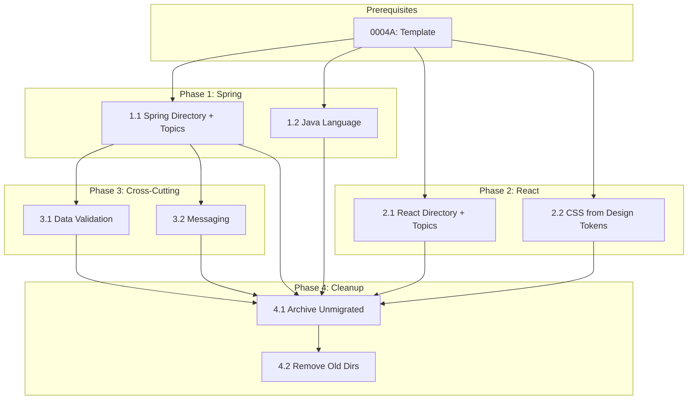

# 0004B_standards-migration

**Status:** DRAFT

---

## Overview

Migrate existing Java and React standards from backend/frontend structure to new taxonomy. Preserve all content while reformatting to match new template.

**Related Plans:**
- `0004_standards-restructure.md` - Parent plan
- `0004A_standards-template.md` - Template (prereq)

## Goals

1. Migrate 19 Java standards to appropriate new categories
2. Migrate 10 React standards to appropriate new categories
3. Preserve all existing patterns and anti-patterns
4. Add metadata sections to migrated content
5. Remove old backend/frontend directories

## Non-Goals

- Creating new standards (only migrating existing)
- Fetching from authoritative sources (that's in other subplans)

---

## Migration Mapping

### Java Standards (backend/java/ → new locations)

| Current File | New Location | Category |
|--------------|--------------|----------|
| architecture.md | frameworks/spring/architecture.md | Frameworks |
| models.md | languages/java.md | Languages |
| resiliency-*.md (4 files) | frameworks/spring/resiliency.md | Frameworks |
| observability-*.md (3 files) | frameworks/spring/observability.md | Frameworks |
| testing-*.md (3 files) | frameworks/spring/testing.md | Frameworks |
| error-handling.md | frameworks/spring/error-handling.md | Frameworks |
| validation.md | data/data-validation.md | Data |
| caching.md | frameworks/spring/caching.md | Frameworks |
| security.md | frameworks/spring/security.md | Frameworks |
| events.md | protocols-transports/messaging.md | Protocols |

### React Standards (frontend/react/ → new locations)

| Current File | New Location | Category |
|--------------|--------------|----------|
| architecture.md | frameworks/react/architecture.md | Frameworks |
| components.md | frameworks/react/components.md | Frameworks |
| code-organization.md | frameworks/react/architecture.md | Frameworks |
| guiding-principles.md | frameworks/react/conventions.md | Frameworks |
| design-tokens.md | languages/css.md | Languages |
| state-management.md | frameworks/react/state-management.md | Frameworks |
| error-handling.md | frameworks/react/error-handling.md | Frameworks |
| observability.md | frameworks/react/observability.md | Frameworks |
| testing.md | frameworks/react/testing.md | Frameworks |

---

## Phase 1: Create Spring Standards

**Prereqs:** 0004A complete

### 1.1 Create Spring Directory Structure

**Files:**
- CREATE: `content/standards/frameworks/spring/README.md`
- CREATE: `content/standards/frameworks/spring/architecture.md`
- CREATE: `content/standards/frameworks/spring/error-handling.md`
- CREATE: `content/standards/frameworks/spring/testing.md`
- CREATE: `content/standards/frameworks/spring/observability.md`
- CREATE: `content/standards/frameworks/spring/resiliency.md`
- CREATE: `content/standards/frameworks/spring/caching.md`
- CREATE: `content/standards/frameworks/spring/security.md`
- READ: All `content/standards/backend/java/*.md` files

**Implementation:**

1. Create `frameworks/spring/` directory
2. Create README.md with index of all Spring topics
3. Migrate each topic to its own file with template structure:
   - `architecture.md` ← from backend/java/architecture.md
   - `error-handling.md` ← from backend/java/error-handling.md
   - `testing.md` ← consolidated from backend/java/testing-*.md (3 files)
   - `observability.md` ← consolidated from backend/java/observability-*.md (3 files)
   - `resiliency.md` ← consolidated from backend/java/resiliency-*.md (4 files)
   - `caching.md` ← from backend/java/caching.md
   - `security.md` ← from backend/java/security.md

4. Each topic file includes metadata:
```markdown
## Metadata

| Field | Value |
|-------|-------|
| Category | `frameworks/spring` |
| Topic | `{topic-name}` |
| Authoritative Sources | Spring Framework Docs, Reactor Docs, Resilience4j |
| Last Updated | {today} |
```

**Verification:**

```bash
ls content/standards/frameworks/spring/
# Expected: README.md + 7 topic files

# Verify each file has content
for f in content/standards/frameworks/spring/*.md; do
  echo "$f: $(wc -l < "$f") lines"
done
```

**Commit:** `docs(standards): migrate Java backend to frameworks/spring/`

---

### 1.2 Extract Java Language Patterns

**Files:**
- CREATE: `content/standards/languages/java.md`
- READ: `content/standards/backend/java/models.md`

**Implementation:**

Extract language-specific content (records, immutability) from models.md:

```markdown
# Java Standard

## Metadata

| Field | Value |
|-------|-------|
| Category | `languages` |
| Authoritative Sources | Oracle Java Docs, Google Java Style Guide |
| Last Updated | {today} |

## Intent

Define Java language patterns for pure data objects and modern Java idioms.

## Topics

### Conventions

#### Records for Data Objects

{content from models.md about records}

### Architecture

#### Package Structure

{content from architecture.md about naming}
```

**Verification:**

```bash
grep -c "record" content/standards/languages/java.md
# Expected: > 5 (record examples)
```

**Commit:** `docs(standards): create languages/java from models.md`

---

## Phase 2: Create React Standards

**Prereqs:** 0004A complete

### 2.1 Create React Directory Structure

**Files:**
- CREATE: `content/standards/frameworks/react/README.md`
- CREATE: `content/standards/frameworks/react/architecture.md`
- CREATE: `content/standards/frameworks/react/components.md`
- CREATE: `content/standards/frameworks/react/conventions.md`
- CREATE: `content/standards/frameworks/react/state-management.md`
- CREATE: `content/standards/frameworks/react/error-handling.md`
- CREATE: `content/standards/frameworks/react/testing.md`
- CREATE: `content/standards/frameworks/react/observability.md`
- READ: All `content/standards/frontend/react/*.md` files

**Implementation:**

1. Create `frameworks/react/` directory
2. Create README.md with index of all React topics
3. Migrate each topic to its own file with template structure:
   - `architecture.md` ← merged from frontend/react/architecture.md + code-organization.md
   - `components.md` ← from frontend/react/components.md
   - `conventions.md` ← from frontend/react/guiding-principles.md
   - `state-management.md` ← from frontend/react/state-management.md
   - `error-handling.md` ← from frontend/react/error-handling.md
   - `testing.md` ← from frontend/react/testing.md
   - `observability.md` ← from frontend/react/observability.md

4. Each topic file includes metadata:
```markdown
## Metadata

| Field | Value |
|-------|-------|
| Category | `frameworks/react` |
| Topic | `{topic-name}` |
| Authoritative Sources | React Docs, React TypeScript Cheatsheet |
| Last Updated | {today} |
```

**Verification:**

```bash
ls content/standards/frameworks/react/
# Expected: README.md + 7 topic files

# Verify each file has content
for f in content/standards/frameworks/react/*.md; do
  echo "$f: $(wc -l < "$f") lines"
done
```

**Commit:** `docs(standards): migrate React frontend to frameworks/react/`

---

### 2.2 Extract CSS Patterns

**Files:**
- CREATE: `content/standards/languages/css.md`
- READ: `content/standards/frontend/react/design-tokens.md`

**Implementation:**

Extract CSS-specific content (design tokens, theming):

```markdown
# CSS Standard

## Metadata

| Field | Value |
|-------|-------|
| Category | `languages` |
| Authoritative Sources | MDN CSS, CSS Tricks, Tailwind Docs |
| Last Updated | {today} |

## Topics

### Design Tokens

{content from design-tokens.md}
```

**Verification:**

```bash
cat content/standards/languages/css.md | head -30
# Expected: Design tokens content
```

**Commit:** `docs(standards): create languages/css from design-tokens`

---

## Phase 3: Extract Cross-Cutting Standards

**Prereqs:** Phase 1, Phase 2

### 3.1 Create Validation Standard

**Files:**
- CREATE: `content/standards/data/data-validation.md`
- READ: `content/standards/backend/java/validation.md`

**Implementation:**

Generalize validation patterns for the data category:

```markdown
# Data Validation Standard

## Metadata

| Field | Value |
|-------|-------|
| Category | `data` |
| Authoritative Sources | OWASP Input Validation, JSON Schema |
| Last Updated | {today} |

## Topics

### Patterns

{Generalized validation patterns from Java validation.md}

### Error Response Format

{Validation error structure}
```

**Commit:** `docs(standards): create data/data-validation`

---

### 3.2 Create Messaging Standard

**Files:**
- CREATE: `content/standards/protocols-transports/messaging.md`
- READ: `content/standards/backend/java/events.md`

**Implementation:**

Extract event-driven patterns for messaging:

```markdown
# Messaging Standard

## Metadata

| Field | Value |
|-------|-------|
| Category | `protocols-transports` |
| Authoritative Sources | CloudEvents Spec, Apache Kafka Docs |
| Last Updated | {today} |

## Topics

### Event Structure

{content from events.md}

### Pub/Sub Patterns

{patterns for message publishing/subscribing}
```

**Commit:** `docs(standards): create protocols-transports/messaging`

---

## Phase 4: Cleanup

**Prereqs:** Phase 1, Phase 2, Phase 3

### 4.1 Archive Unmigrated Files

**Files:**
- ARCHIVE: `content/standards/backend/java/README.md`
- ARCHIVE: `content/standards/backend/java/CODEX_findings.md`
- ARCHIVE: `content/standards/frontend/react/README.md`
- ARCHIVE: `content/standards/frontend/react/CODEX_findings.md`

**Implementation:**

These files don't fit the new taxonomy but contain valuable context:
- README.md files are indexes (replaced by new category READMEs)
- CODEX_findings.md files contain AI review notes worth preserving

Archive to `docs/archive/standards-legacy/`:

```bash
mkdir -p docs/archive/standards-legacy
cp content/standards/backend/java/README.md docs/archive/standards-legacy/backend-java-README.md
cp content/standards/backend/java/CODEX_findings.md docs/archive/standards-legacy/backend-java-CODEX_findings.md
cp content/standards/frontend/react/README.md docs/archive/standards-legacy/frontend-react-README.md
cp content/standards/frontend/react/CODEX_findings.md docs/archive/standards-legacy/frontend-react-CODEX_findings.md
```

**Verification:**

```bash
ls docs/archive/standards-legacy/
# Expected: 4 archived files
```

**Commit:** `chore(standards): archive legacy README and CODEX files`

---

### 4.2 Remove Old Directories

**Files:**
- DELETE: `content/standards/backend/`
- DELETE: `content/standards/frontend/`

**Implementation:**

```bash
rm -rf content/standards/backend/
rm -rf content/standards/frontend/
```

**Verification:**

```bash
ls content/standards/
# Expected: Only new category folders, no backend/frontend
```

**Commit:** `chore(standards): remove deprecated backend/frontend structure`

---

## Files Summary

| Action | File | Purpose |
|--------|------|---------|
| CREATE | `content/standards/frameworks/spring/README.md` | Spring topic index |
| CREATE | `content/standards/frameworks/spring/architecture.md` | Spring architecture patterns |
| CREATE | `content/standards/frameworks/spring/error-handling.md` | Spring error handling |
| CREATE | `content/standards/frameworks/spring/testing.md` | Spring testing patterns |
| CREATE | `content/standards/frameworks/spring/observability.md` | Spring observability |
| CREATE | `content/standards/frameworks/spring/resiliency.md` | Spring resiliency patterns |
| CREATE | `content/standards/frameworks/spring/caching.md` | Spring caching patterns |
| CREATE | `content/standards/frameworks/spring/security.md` | Spring security patterns |
| CREATE | `content/standards/frameworks/react/README.md` | React topic index |
| CREATE | `content/standards/frameworks/react/architecture.md` | React architecture patterns |
| CREATE | `content/standards/frameworks/react/components.md` | React component patterns |
| CREATE | `content/standards/frameworks/react/conventions.md` | React conventions/principles |
| CREATE | `content/standards/frameworks/react/state-management.md` | React state management |
| CREATE | `content/standards/frameworks/react/error-handling.md` | React error handling |
| CREATE | `content/standards/frameworks/react/testing.md` | React testing patterns |
| CREATE | `content/standards/frameworks/react/observability.md` | React observability |
| CREATE | `content/standards/languages/java.md` | Java language patterns |
| CREATE | `content/standards/languages/css.md` | CSS patterns |
| CREATE | `content/standards/data/data-validation.md` | Validation patterns |
| CREATE | `content/standards/protocols-transports/messaging.md` | Event/messaging patterns |
| ARCHIVE | `docs/archive/standards-legacy/*` | Legacy README and CODEX files |
| DELETE | `content/standards/backend/` | Old structure |
| DELETE | `content/standards/frontend/` | Old structure |

---

## Testing Strategy

### Automated Tests

| Type | What It Tests | Command |
|------|---------------|---------|
| Unit | Migrated files match template | `bun test tests/standards/` |

### Manual Validation

1. Compare original Java standards with `frameworks/spring/*.md` - verify no content lost
2. Compare original React standards with `frameworks/react/*.md` - verify no content lost
3. Verify cross-references updated to new paths
4. Verify each framework directory has README.md index
5. Confirm README and CODEX files archived to docs/archive/standards-legacy/
6. Confirm old directories removed

---

## Dependency Graph



**Parallel Opportunities:**
- Phases 1 and 2 can run in parallel (Java and React independent)
- Tasks within each phase can run in parallel

---

## Checklist

- [ ] Phase 1 complete (Spring directory with 8 topic files + Java language)
- [ ] Phase 2 complete (React directory with 8 topic files + CSS)
- [ ] Phase 3 complete (Validation + Messaging)
- [ ] Phase 4 complete (Archive + Cleanup)
- [ ] Each framework directory has README.md index
- [ ] README and CODEX files archived
- [ ] No content lost in migration
- [ ] All new files match template

---

*Plan created with agent-kit. Execute with `/implement-plan`.*
