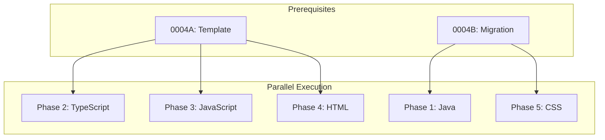

# 0004C_standards-languages

**Status:** DRAFT

---

## Overview

Create language standards for Java, TypeScript, JavaScript, HTML, and CSS by researching authoritative sources and synthesizing best practices. Java and CSS have initial content from migration; others need full creation.

**Related Plans:**
- `0004_standards-restructure.md` - Parent plan
- `0004A_standards-template.md` - Template (prereq)
- `0004B_standards-migration.md` - Provides initial Java/CSS content

## Goals

1. Create/complete standards for all 5 languages
2. Source patterns from authoritative references
3. Apply cross-cutting topics where applicable
4. Ensure consistent structure via template

---

## Authoritative Sources by Language

### Java

| Source | Type | URL | Extract |
|--------|------|-----|---------|
| Oracle Java Tutorials | Official | https://docs.oracle.com/javase/tutorial/ | Core patterns |
| Google Java Style | Style Guide | https://google.github.io/styleguide/javaguide.html | Conventions |
| Effective Java (Bloch) | Book | Reference | Best practices |
| OpenJDK JEPs | Specification | https://openjdk.org/jeps/ | Modern features |

**Research Steps:**
1. WebSearch: `"java 21 best practices" site:oracle.com`
2. WebFetch: Google Java Style Guide for naming conventions
3. WebSearch: `"java records" "sealed classes" best practices`

### TypeScript

| Source | Type | URL | Extract |
|--------|------|-----|---------|
| TypeScript Handbook | Official | https://www.typescriptlang.org/docs/handbook/ | Core patterns |
| TypeScript Style Guide | Official | https://google.github.io/styleguide/tsguide.html | Google guide |
| Microsoft TS Guidelines | Official | https://github.com/microsoft/TypeScript/wiki/Coding-guidelines | MS internal |
| Total TypeScript | Expert | https://www.totaltypescript.com/ | Advanced patterns |

**Research Steps:**
1. WebFetch: TypeScript Handbook - Everyday Types
2. WebSearch: `"typescript strict mode" best practices 2024`
3. WebSearch: `"typescript utility types" patterns`

### JavaScript

| Source | Type | URL | Extract |
|--------|------|-----|---------|
| MDN JavaScript Guide | Official | https://developer.mozilla.org/en-US/docs/Web/JavaScript/Guide | Core patterns |
| Airbnb Style Guide | Style Guide | https://github.com/airbnb/javascript | Conventions |
| ES Modules Spec | Specification | https://tc39.es/ecma262/ | Module patterns |
| JavaScript.info | Tutorial | https://javascript.info/ | Modern JS |

**Research Steps:**
1. WebFetch: MDN JavaScript Guide for core patterns
2. WebFetch: Airbnb JavaScript Style Guide
3. WebSearch: `"es2024" "javascript" new features`

### HTML

| Source | Type | URL | Extract |
|--------|------|-----|---------|
| HTML Living Standard | Official | https://html.spec.whatwg.org/ | Specification |
| MDN HTML Reference | Official | https://developer.mozilla.org/en-US/docs/Web/HTML | Reference |
| Google HTML/CSS Guide | Style Guide | https://google.github.io/styleguide/htmlcssguide.html | Conventions |
| Web.dev | Best Practices | https://web.dev/learn/html | Accessibility |

**Research Steps:**
1. WebFetch: MDN HTML elements reference
2. WebSearch: `"semantic html" best practices 2024`
3. WebSearch: `"html accessibility" WCAG patterns`

### CSS

| Source | Type | URL | Extract |
|--------|------|-----|---------|
| MDN CSS Reference | Official | https://developer.mozilla.org/en-US/docs/Web/CSS | Reference |
| CSS Tricks | Expert | https://css-tricks.com/ | Patterns |
| Google HTML/CSS Guide | Style Guide | https://google.github.io/styleguide/htmlcssguide.html | Conventions |
| Modern CSS | Tutorial | https://moderncss.dev/ | Modern patterns |

**Research Steps:**
1. WebFetch: MDN CSS Layout guide
2. WebSearch: `"css custom properties" "design tokens" patterns`
3. WebSearch: `"css container queries" best practices 2024`

---

## Phase 1: Complete Java Standard

**Prereqs:** 0004A, 0004B (provides initial content)

### 1.1 Enrich Java with Authoritative Sources

**Files:**
- MODIFY: `content/standards/languages/java.md`

**Implementation:**

1. WebFetch Google Java Style Guide
2. Extract naming conventions, formatting rules
3. Add to Conventions section
4. Add source citations to metadata

**Research Execution:**
```
WebSearch: "google java style guide"
WebFetch: https://google.github.io/styleguide/javaguide.html
Prompt: "Extract naming conventions for classes, methods, variables, and constants. Include formatting rules for line length and indentation."
```

**Verification:**

```bash
grep -c "Authoritative Sources" content/standards/languages/java.md
# Expected: 1 (metadata section present)
```

**Commit:** `docs(standards): enrich java with authoritative sources`

---

## Phase 2: Create TypeScript Standard

**Prereqs:** 0004A

### 2.1 Create TypeScript Standard

**Files:**
- CREATE: `content/standards/languages/typescript.md`

**Implementation:**

1. Research TypeScript handbook and style guides
2. Create standard with template structure
3. Focus on type-level programming patterns

**Research Execution:**
```
WebSearch: "typescript best practices 2024"
WebFetch: https://www.typescriptlang.org/docs/handbook/2/everyday-types.html
Prompt: "Extract type patterns: union types, type guards, generics, utility types. Focus on type safety patterns."

WebFetch: https://google.github.io/styleguide/tsguide.html
Prompt: "Extract TypeScript-specific conventions: naming, imports, type annotations."
```

**Content Structure:**
```markdown
# TypeScript Standard

## Metadata
| Field | Value |
|-------|-------|
| Category | `languages` |
| Authoritative Sources | TypeScript Handbook, Google TS Guide |
| Last Updated | {today} |

## Topics

### Conventions
- Naming (interfaces, types, enums)
- Import ordering
- File naming

### Architecture
- Module organization
- Barrel exports (when to avoid)
- Declaration files

### Error Handling
- Error types
- Result types vs exceptions
- Type narrowing for errors

### Testing
- Type testing patterns
- Mock typing

### Performance
- Strict mode benefits
- Type inference optimization
```

**Commit:** `docs(standards): create languages/typescript`

---

## Phase 3: Create JavaScript Standard

**Prereqs:** 0004A

### 3.1 Create JavaScript Standard

**Files:**
- CREATE: `content/standards/languages/javascript.md`

**Implementation:**

**Research Execution:**
```
WebFetch: https://github.com/airbnb/javascript
Prompt: "Extract JavaScript conventions: variable declarations, functions, objects, arrays, modules."

WebSearch: "mdn javascript best practices"
WebFetch: https://developer.mozilla.org/en-US/docs/Web/JavaScript/Guide
Prompt: "Extract patterns for async/await, error handling, and module usage."
```

**Content Focus:**
- ES Modules patterns
- Async/await patterns
- Destructuring conventions
- Optional chaining and nullish coalescing

**Commit:** `docs(standards): create languages/javascript`

---

## Phase 4: Create HTML Standard

**Prereqs:** 0004A

### 4.1 Create HTML Standard

**Files:**
- CREATE: `content/standards/languages/html.md`

**Implementation:**

**Research Execution:**
```
WebSearch: "semantic html best practices"
WebFetch: https://developer.mozilla.org/en-US/docs/Web/HTML
Prompt: "Extract semantic element usage: header, nav, main, article, section, aside, footer."

WebSearch: "html accessibility wcag"
WebFetch: https://web.dev/learn/accessibility
Prompt: "Extract accessibility patterns: ARIA, landmarks, form labels, focus management."
```

**Content Focus:**
- Semantic structure
- Accessibility patterns
- Form patterns
- Meta tags and SEO

**Commit:** `docs(standards): create languages/html`

---

## Phase 5: Complete CSS Standard

**Prereqs:** 0004A, 0004B (provides initial content)

### 5.1 Enrich CSS with Authoritative Sources

**Files:**
- MODIFY: `content/standards/languages/css.md`

**Implementation:**

**Research Execution:**
```
WebSearch: "css custom properties best practices"
WebFetch: https://moderncss.dev/
Prompt: "Extract modern CSS patterns: custom properties, container queries, logical properties."

WebFetch: https://css-tricks.com/a-complete-guide-to-css-grid/
Prompt: "Extract Grid layout patterns and anti-patterns."
```

**Content Focus:**
- Custom properties (design tokens)
- Layout patterns (Grid, Flexbox)
- Modern CSS features
- Naming conventions (BEM or alternatives)

**Commit:** `docs(standards): enrich css with authoritative sources`

---

## Files Summary

| Action | File | Purpose |
|--------|------|---------|
| MODIFY | `content/standards/languages/java.md` | Enrich with sources |
| CREATE | `content/standards/languages/typescript.md` | TypeScript patterns |
| CREATE | `content/standards/languages/javascript.md` | JavaScript patterns |
| CREATE | `content/standards/languages/html.md` | HTML patterns |
| MODIFY | `content/standards/languages/css.md` | Enrich with sources |

---

## Testing Strategy

### Automated Tests

| Type | What It Tests | Command |
|------|---------------|---------|
| Unit | All standards match template | `bun test tests/standards/` |

### Manual Validation

1. Verify each standard has metadata with authoritative sources
2. Check cross-cutting topics are present where applicable
3. Confirm code examples are language-appropriate
4. Validate anti-patterns section exists

---

## Dependency Graph



**Parallel Opportunities:**
- TypeScript, JavaScript, HTML can run in parallel (no migration deps)
- Java and CSS depend on migration completing first

---

## Checklist

- [ ] Java standard enriched
- [ ] TypeScript standard created
- [ ] JavaScript standard created
- [ ] HTML standard created
- [ ] CSS standard enriched
- [ ] All standards validated against template
- [ ] Authoritative sources cited in each

---

*Plan created with agent-kit. Execute with `/implement-plan`.*
