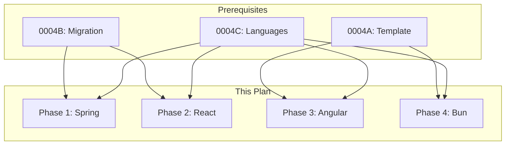

# 0004D_standards-frameworks

**Status:** DRAFT

---

## Overview

Create framework standards for Spring, React, Angular, and Bun by researching authoritative sources. Spring and React have initial content from migration; Angular and Bun need full creation.

**Related Plans:**
- `0004_standards-restructure.md` - Parent plan
- `0004A_standards-template.md` - Template (prereq)
- `0004B_standards-migration.md` - Provides Spring/React content
- `0004C_standards-languages.md` - Language foundations

## Goals

1. Create/complete standards for all 4 frameworks
2. Source patterns from authoritative references
3. Apply all cross-cutting topics (frameworks need most topics)
4. Link to corresponding language standards

---

## Authoritative Sources by Framework

### Spring (Spring Boot + WebFlux)

| Source | Type | URL | Extract |
|--------|------|-----|---------|
| Spring Docs | Official | https://docs.spring.io/spring-boot/docs/current/reference/html/ | Reference |
| Spring Guides | Official | https://spring.io/guides | Patterns |
| Reactor Docs | Official | https://projectreactor.io/docs/core/release/reference/ | Reactive |
| Resilience4j | Official | https://resilience4j.readme.io/docs | Resiliency |

**Research Steps:**
1. WebFetch: Spring Boot Reference - Best Practices
2. WebFetch: Reactor Core Reference - Patterns
3. WebSearch: `"spring webflux" best practices 2024`

### React

| Source | Type | URL | Extract |
|--------|------|-----|---------|
| React Docs | Official | https://react.dev/ | Reference |
| TanStack Query | Official | https://tanstack.com/query/latest | Data fetching |
| TanStack Router | Official | https://tanstack.com/router/latest | Routing |
| React Patterns | Expert | https://reactpatterns.com/ | Patterns |

**Research Steps:**
1. WebFetch: React.dev - Thinking in React
2. WebFetch: TanStack Query - Best Practices
3. WebSearch: `"react server components" patterns 2024`

### Angular

| Source | Type | URL | Extract |
|--------|------|-----|---------|
| Angular Docs | Official | https://angular.dev/ | Reference |
| Angular Style Guide | Official | https://angular.dev/style-guide | Conventions |
| RxJS Docs | Official | https://rxjs.dev/ | Reactive |
| NgRx | Official | https://ngrx.io/ | State |

**Research Steps:**
1. WebFetch: Angular Style Guide
2. WebFetch: Angular - Best Practices
3. WebSearch: `"angular signals" patterns 2024`

### Bun

| Source | Type | URL | Extract |
|--------|------|-----|---------|
| Bun Docs | Official | https://bun.sh/docs | Reference |
| Bun Guides | Official | https://bun.sh/guides | Patterns |
| Bun Blog | Official | https://bun.sh/blog | Updates |

**Research Steps:**
1. WebFetch: Bun Docs - Overview
2. WebSearch: `"bun runtime" best practices`
3. WebSearch: `"bun test" patterns`

---

## Phase 1: Complete Spring Standard

**Prereqs:** 0004A, 0004B (provides content)

### 1.1 Enrich Spring with Authoritative Sources

**Files:**
- MODIFY: `content/standards/frameworks/spring.md`

**Implementation:**

1. WebFetch Spring Boot Reference
2. Add official patterns for:
   - Configuration
   - Testing (@SpringBootTest vs @WebFluxTest)
   - Metrics and health endpoints
3. Add source citations

**Research Execution:**
```
WebFetch: https://docs.spring.io/spring-boot/docs/current/reference/html/features.html
Prompt: "Extract Spring Boot configuration patterns: profiles, properties, externalized config."

WebFetch: https://projectreactor.io/docs/core/release/reference/#which-operator
Prompt: "Extract Reactor operator selection patterns: when to use flatMap, concatMap, switchMap."
```

**Commit:** `docs(standards): enrich spring with authoritative sources`

---

## Phase 2: Complete React Standard

**Prereqs:** 0004A, 0004B (provides content)

### 2.1 Enrich React with Authoritative Sources

**Files:**
- MODIFY: `content/standards/frameworks/react.md`

**Implementation:**

1. WebFetch React.dev
2. Add patterns for:
   - Hooks usage (custom hooks)
   - Component composition
   - Performance optimization
3. Add TanStack patterns

**Research Execution:**
```
WebFetch: https://react.dev/learn/thinking-in-react
Prompt: "Extract component design patterns: breaking UI into components, state ownership."

WebFetch: https://tanstack.com/query/latest/docs/framework/react/guides/queries
Prompt: "Extract TanStack Query patterns: query keys, stale time, caching strategies."
```

**Commit:** `docs(standards): enrich react with authoritative sources`

---

## Phase 3: Create Angular Standard

**Prereqs:** 0004A

### 3.1 Create Angular Standard

**Files:**
- CREATE: `content/standards/frameworks/angular.md`

**Implementation:**

**Research Execution:**
```
WebFetch: https://angular.dev/style-guide
Prompt: "Extract Angular conventions: file naming, module organization, component patterns."

WebSearch: "angular signals best practices 2024"
Prompt: "Extract Signal patterns: when to use signals vs observables, computed signals."

WebFetch: https://ngrx.io/guide/store/walkthrough
Prompt: "Extract NgRx patterns: selectors, effects, entity state."
```

**Content Structure:**
```markdown
# Angular Standard

## Metadata
| Field | Value |
|-------|-------|
| Category | `frameworks` |
| Authoritative Sources | Angular.dev, Angular Style Guide, NgRx |
| Last Updated | {today} |

## Topics

### Architecture
- Module organization (standalone vs NgModules)
- Feature module patterns
- Lazy loading

### Conventions
- File naming
- Component selectors
- Service patterns

### State Management
- Signals vs Observables
- NgRx patterns
- Local vs global state

### Testing
- Component testing
- Service testing
- E2E with Playwright

### Observability
- Error handling with RxJS
- Logging patterns

### Performance
- Change detection
- OnPush strategy
- trackBy for ngFor
```

**Commit:** `docs(standards): create frameworks/angular`

---

## Phase 4: Create Bun Standard

**Prereqs:** 0004A

### 4.1 Create Bun Standard

**Files:**
- CREATE: `content/standards/frameworks/bun.md`

**Implementation:**

**Research Execution:**
```
WebFetch: https://bun.sh/docs
Prompt: "Extract Bun runtime patterns: file I/O, HTTP server, bundler usage."

WebFetch: https://bun.sh/docs/test/writing
Prompt: "Extract Bun test patterns: describe/it/expect, mocking, snapshots."

WebSearch: "bun shell" patterns
Prompt: "Extract Bun shell patterns: command execution, scripting."
```

**Content Structure:**
```markdown
# Bun Standard

## Metadata
| Field | Value |
|-------|-------|
| Category | `frameworks` |
| Authoritative Sources | Bun.sh Docs |
| Last Updated | {today} |

## Topics

### Architecture
- Project structure
- Package management (bun install)
- Bundling

### Conventions
- bun.lockb handling
- bunfig.toml patterns

### Testing
- bun:test patterns
- Mocking
- Coverage

### Performance
- Native APIs vs npm packages
- Memory management
- Startup optimization
```

**Commit:** `docs(standards): create frameworks/bun`

---

## Files Summary

| Action | File | Purpose |
|--------|------|---------|
| MODIFY | `content/standards/frameworks/spring.md` | Enrich with sources |
| MODIFY | `content/standards/frameworks/react.md` | Enrich with sources |
| CREATE | `content/standards/frameworks/angular.md` | Angular patterns |
| CREATE | `content/standards/frameworks/bun.md` | Bun runtime patterns |

---

## Testing Strategy

### Automated Tests

| Type | What It Tests | Command |
|------|---------------|---------|
| Unit | All standards match template structure | `bun test tests/standards/` |

### Manual Validation

1. Verify each standard has complete metadata with authoritative sources
2. Check cross-cutting topics are present where applicable
3. Confirm code examples are framework-appropriate
4. Validate anti-patterns section exists

---

## Dependency Graph



**Parallel Opportunities:**
- Angular and Bun can run in parallel (no migration deps)
- Spring and React can run in parallel after migration

---

## Checklist

- [ ] Spring standard enriched
- [ ] React standard enriched
- [ ] Angular standard created
- [ ] Bun standard created
- [ ] All standards link to language foundations
- [ ] Authoritative sources cited

---

*Plan created with agent-kit. Execute with `/implement-plan`.*
