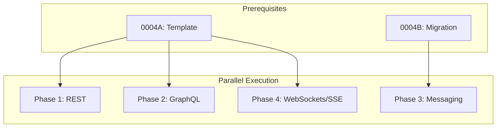

# 0004E_standards-protocols

**Status:** DRAFT

---

## Overview

Create protocol and transport standards for REST, GraphQL, messaging (pub/sub), and WebSockets/SSE. Messaging has initial content from migration; others need full creation from RFCs and specifications.

**Related Plans:**
- `0004_standards-restructure.md` - Parent plan
- `0004A_standards-template.md` - Template (prereq)
- `0004B_standards-migration.md` - Provides messaging content

## Goals

1. Create standards for all 4 protocol categories
2. Source patterns from RFCs and official specifications
3. Focus on cross-cutting topics: Error Handling, Validation, Observability, Security
4. Include language-agnostic patterns (applicable to Java, TypeScript, etc.)

---

## Authoritative Sources by Protocol

### REST

| Source | Type | URL | Extract |
|--------|------|-----|---------|
| RFC 7231 | Specification | https://datatracker.ietf.org/doc/html/rfc7231 | HTTP Semantics |
| RFC 9110 | Specification | https://datatracker.ietf.org/doc/html/rfc9110 | HTTP Semantics (new) |
| Richardson Maturity Model | Expert | https://martinfowler.com/articles/richardsonMaturityModel.html | REST levels |
| JSON:API | Specification | https://jsonapi.org/ | Response format |
| Problem Details (RFC 9457) | Specification | https://datatracker.ietf.org/doc/html/rfc9457 | Error format |

**Research Steps:**
1. WebFetch: RFC 9110 for HTTP methods and status codes
2. WebFetch: Martin Fowler's Richardson Maturity Model
3. WebFetch: RFC 9457 for error response format

### GraphQL

| Source | Type | URL | Extract |
|--------|------|-----|---------|
| GraphQL Spec | Official | https://spec.graphql.org/ | Specification |
| Apollo Best Practices | Expert | https://www.apollographql.com/docs/react/data/operation-best-practices/ | Patterns |
| GraphQL Foundation | Official | https://graphql.org/learn/best-practices/ | Best practices |
| Relay Spec | Specification | https://relay.dev/docs/guides/graphql-server-specification/ | Pagination |

**Research Steps:**
1. WebFetch: GraphQL spec for type system
2. WebFetch: GraphQL.org best practices
3. WebSearch: `"graphql error handling" patterns`

### Messaging (Pub/Sub)

| Source | Type | URL | Extract |
|--------|------|-----|---------|
| CloudEvents | Specification | https://cloudevents.io/ | Event format |
| Apache Kafka | Official | https://kafka.apache.org/documentation/ | Patterns |
| AWS EventBridge | Official | https://docs.aws.amazon.com/eventbridge/ | Event patterns |
| Enterprise Integration Patterns | Expert | https://www.enterpriseintegrationpatterns.com/ | Patterns |

**Research Steps:**
1. WebFetch: CloudEvents spec for event structure
2. WebFetch: Enterprise Integration Patterns
3. WebSearch: `"event-driven architecture" patterns 2024`

### WebSockets / SSE

| Source | Type | URL | Extract |
|--------|------|-----|---------|
| RFC 6455 | Specification | https://datatracker.ietf.org/doc/html/rfc6455 | WebSocket |
| MDN SSE | Reference | https://developer.mozilla.org/en-US/docs/Web/API/Server-sent_events | SSE |
| Socket.IO | Expert | https://socket.io/docs/v4/ | Patterns |
| WHATWG SSE | Specification | https://html.spec.whatwg.org/multipage/server-sent-events.html | SSE spec |

**Research Steps:**
1. WebFetch: MDN WebSocket guide
2. WebFetch: MDN SSE guide
3. WebSearch: `"websocket vs sse" when to use`

---

## Phase 1: Create REST Standard

**Prereqs:** 0004A

### 1.1 Create REST Standard

**Files:**
- CREATE: `content/standards/protocols-transports/rest.md`

**Implementation:**

**Research Execution:**
```
WebFetch: https://datatracker.ietf.org/doc/html/rfc9110
Prompt: "Extract HTTP method semantics: GET, POST, PUT, PATCH, DELETE. Include idempotency and safety."

WebFetch: https://martinfowler.com/articles/richardsonMaturityModel.html
Prompt: "Extract REST maturity levels and what each level requires."

WebFetch: https://datatracker.ietf.org/doc/html/rfc9457
Prompt: "Extract Problem Details format for error responses."
```

**Content Structure:**
```markdown
# REST Standard

## Metadata
| Field | Value |
|-------|-------|
| Category | `protocols-transports` |
| Authoritative Sources | RFC 9110, RFC 9457, Richardson Maturity Model |
| Last Updated | {today} |

## Topics

### Conventions
- URL structure (/resources/{id})
- HTTP method usage
- Status code selection
- Header conventions

### Error Handling
- Problem Details format (RFC 9457)
- Error response structure
- Status code mapping

### Validation
- Request validation
- Query parameter validation
- Validation error format

### Observability
- Correlation headers (X-Request-ID, traceparent)
- Logging patterns
- Metrics (latency, status codes)

### Security
- Authentication headers
- CORS patterns
- Rate limiting headers

### Performance
- Caching headers (ETag, Cache-Control)
- Pagination patterns
- Compression
```

**Commit:** `docs(standards): create protocols-transports/rest`

---

## Phase 2: Create GraphQL Standard

**Prereqs:** 0004A

### 2.1 Create GraphQL Standard

**Files:**
- CREATE: `content/standards/protocols-transports/graphql.md`

**Implementation:**

**Research Execution:**
```
WebFetch: https://graphql.org/learn/best-practices/
Prompt: "Extract GraphQL best practices: nullability, pagination, versioning."

WebSearch: "graphql error handling patterns"
Prompt: "Extract error handling: errors array, extensions, partial responses."

WebFetch: https://relay.dev/docs/guides/graphql-server-specification/
Prompt: "Extract Relay pagination patterns: Connection, Edge, PageInfo."
```

**Content Structure:**
```markdown
# GraphQL Standard

## Topics

### Conventions
- Schema design
- Naming (types, fields, enums)
- Query vs Mutation boundaries

### Error Handling
- Errors array format
- Partial success handling
- Error extensions

### Validation
- Input validation
- Custom scalars
- Directive validation

### Security
- Query depth limiting
- Query complexity analysis
- Persisted queries

### Performance
- N+1 prevention (DataLoader)
- Batching patterns
- Caching strategies
```

**Commit:** `docs(standards): create protocols-transports/graphql`

---

## Phase 3: Complete Messaging Standard

**Prereqs:** 0004A, 0004B (provides content)

### 3.1 Enrich Messaging with Authoritative Sources

**Files:**
- MODIFY: `content/standards/protocols-transports/messaging.md`

**Implementation:**

**Research Execution:**
```
WebFetch: https://cloudevents.io/
Prompt: "Extract CloudEvents structure: required attributes, extensions, data format."

WebFetch: https://www.enterpriseintegrationpatterns.com/patterns/messaging/
Prompt: "Extract messaging patterns: publish-subscribe, message router, content-based router."
```

**Content Focus:**
- CloudEvents format
- Event sourcing patterns
- Idempotency handling
- Dead letter queues
- Retry strategies

**Commit:** `docs(standards): enrich messaging with authoritative sources`

---

## Phase 4: Create WebSockets/SSE Standard

**Prereqs:** 0004A

### 4.1 Create WebSockets/SSE Standard

**Files:**
- CREATE: `content/standards/protocols-transports/websockets-sse.md`

**Implementation:**

**Research Execution:**
```
WebSearch: "websocket vs sse comparison"
Prompt: "Extract when to use WebSockets vs SSE: bi-directional vs uni-directional, browser support."

WebFetch: https://developer.mozilla.org/en-US/docs/Web/API/WebSocket
Prompt: "Extract WebSocket patterns: connection lifecycle, message types, error handling."

WebFetch: https://developer.mozilla.org/en-US/docs/Web/API/Server-sent_events
Prompt: "Extract SSE patterns: EventSource, retry, event types."
```

**Content Structure:**
```markdown
# WebSockets and SSE Standard

## Topics

### Conventions
- When to use WebSocket vs SSE
- Connection lifecycle
- Message format

### Error Handling
- Connection errors
- Reconnection strategies
- Heartbeat/ping-pong

### Observability
- Connection metrics
- Message tracing

### Security
- Authentication on connect
- Message validation
- Origin checking

### Performance
- Connection pooling
- Message batching
- Backpressure handling
```

**Commit:** `docs(standards): create protocols-transports/websockets-sse`

---

## Files Summary

| Action | File | Purpose |
|--------|------|---------|
| CREATE | `content/standards/protocols-transports/rest.md` | REST patterns |
| CREATE | `content/standards/protocols-transports/graphql.md` | GraphQL patterns |
| MODIFY | `content/standards/protocols-transports/messaging.md` | Enrich messaging |
| CREATE | `content/standards/protocols-transports/websockets-sse.md` | Real-time patterns |

---

## Testing Strategy

### Automated Tests

| Type | What It Tests | Command |
|------|---------------|---------|
| Unit | All standards match template structure | `bun test tests/standards/` |

### Manual Validation

1. Verify each standard has complete metadata with RFC/spec citations
2. Check cross-cutting topics are present where applicable
3. Confirm examples are language-agnostic where possible
4. Validate anti-patterns section exists

---

## Dependency Graph



**Parallel Opportunities:**
- REST, GraphQL, WebSockets/SSE can run in parallel
- Messaging depends on migration

---

## Checklist

- [ ] REST standard created
- [ ] GraphQL standard created
- [ ] Messaging standard enriched
- [ ] WebSockets/SSE standard created
- [ ] RFC citations included
- [ ] All standards validated

---

*Plan created with agent-kit. Execute with `/implement-plan`.*
