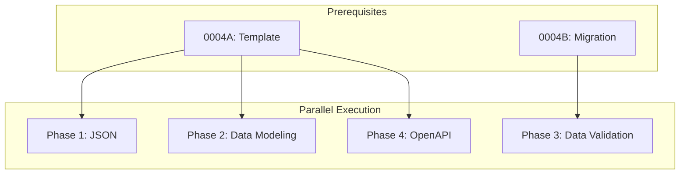

# 0004F_standards-data

**Status:** DRAFT

---

## Overview

Create data standards for JSON, data modeling, data validation, and OpenAPI. Data validation has initial content from migration; others need full creation from specifications.

**Related Plans:**
- `0004_standards-restructure.md` - Parent plan
- `0004A_standards-template.md` - Template (prereq)
- `0004B_standards-migration.md` - Provides validation content

## Goals

1. Create standards for all 4 data categories
2. Source patterns from specifications (JSON, OpenAPI, JSON Schema)
3. Focus on interoperability and consistency
4. Define patterns for schema-first development

---

## Authoritative Sources by Topic

### JSON

| Source | Type | URL | Extract |
|--------|------|-----|---------|
| RFC 8259 | Specification | https://datatracker.ietf.org/doc/html/rfc8259 | JSON format |
| JSON.org | Official | https://www.json.org/ | Format reference |
| JSON5 | Extension | https://json5.org/ | Extended JSON |
| JSON Lines | Specification | https://jsonlines.org/ | Streaming format |

**Research Steps:**
1. WebFetch: RFC 8259 for JSON grammar
2. WebSearch: `"json best practices" serialization`

### Data Modeling

| Source | Type | URL | Extract |
|--------|------|-----|---------|
| Domain-Driven Design | Book | Reference | Strategic patterns |
| Martin Fowler | Expert | https://martinfowler.com/ | Modeling patterns |
| Event Storming | Pattern | https://www.eventstorming.com/ | Discovery |
| Aggregate Design | Expert | https://www.dddcommunity.org/ | Tactical patterns |

**Research Steps:**
1. WebSearch: `"domain driven design" modeling patterns`
2. WebFetch: Martin Fowler's ValueObject pattern
3. WebSearch: `"aggregate root" best practices`

### Data Validation

| Source | Type | URL | Extract |
|--------|------|-----|---------|
| JSON Schema | Specification | https://json-schema.org/ | Validation |
| Zod | Library | https://zod.dev/ | TypeScript validation |
| Bean Validation | Specification | https://beanvalidation.org/ | Java validation |
| OWASP Input Validation | Expert | https://cheatsheetseries.owasp.org/ | Security |

**Research Steps:**
1. WebFetch: JSON Schema specification
2. WebFetch: OWASP Input Validation Cheat Sheet
3. WebSearch: `"zod" validation patterns`

### OpenAPI

| Source | Type | URL | Extract |
|--------|------|-----|---------|
| OpenAPI Spec | Official | https://spec.openapis.org/oas/latest.html | Specification |
| Swagger | Official | https://swagger.io/docs/ | Tooling |
| Stoplight | Expert | https://stoplight.io/api-design-guide | Design guide |
| API Guidelines | Expert | https://opensource.zalando.com/restful-api-guidelines/ | Patterns |

**Research Steps:**
1. WebFetch: OpenAPI 3.1 specification
2. WebFetch: Zalando API Guidelines
3. WebSearch: `"openapi best practices" schema design`

---

## Phase 1: Create JSON Standard

**Prereqs:** 0004A

### 1.1 Create JSON Standard

**Files:**
- CREATE: `content/standards/data/json.md`

**Implementation:**

**Research Execution:**
```
WebFetch: https://datatracker.ietf.org/doc/html/rfc8259
Prompt: "Extract JSON grammar rules: strings, numbers, objects, arrays, null, boolean."

WebSearch: "json naming conventions camelCase vs snake_case"
Prompt: "Extract field naming conventions for JSON APIs."

WebSearch: "json date format iso 8601"
Prompt: "Extract date/time formatting patterns in JSON."
```

**Content Structure:**
```markdown
# JSON Standard

## Metadata
| Field | Value |
|-------|-------|
| Category | `data` |
| Authoritative Sources | RFC 8259, JSON.org |
| Last Updated | {today} |

## Topics

### Conventions
- Field naming (camelCase for JS/TS, snake_case for Python)
- Date/time formatting (ISO 8601)
- Null vs absent fields
- Number precision

### Architecture
- Envelope patterns
- Pagination structures
- HATEOAS links

### Validation
- Schema validation (JSON Schema)
- Type coercion rules

### Performance
- Streaming JSON (JSON Lines)
- Compression patterns
- Size optimization
```

**Commit:** `docs(standards): create data/json`

---

## Phase 2: Create Data Modeling Standard

**Prereqs:** 0004A

### 2.1 Create Data Modeling Standard

**Files:**
- CREATE: `content/standards/data/data-modeling.md`

**Implementation:**

**Research Execution:**
```
WebSearch: "domain driven design modeling patterns"
Prompt: "Extract DDD patterns: Entity, Value Object, Aggregate, Repository."

WebFetch: https://martinfowler.com/eaaCatalog/
Prompt: "Extract patterns: Data Transfer Object, Domain Model, Active Record."

WebSearch: "aggregate root design rules"
Prompt: "Extract aggregate design rules: consistency boundary, transactional boundary."
```

**Content Structure:**
```markdown
# Data Modeling Standard

## Topics

### Architecture
- Entity vs Value Object
- Aggregate boundaries
- Domain events

### Conventions
- Naming (nouns for entities, adjectives for states)
- ID types (UUID vs sequence)
- Timestamp fields

### Patterns
- Immutable value objects
- Rich domain models vs anemic
- Event sourcing

### Anti-patterns
- Anemic domain model
- Aggregate too large
- Cross-aggregate references
```

**Commit:** `docs(standards): create data/data-modeling`

---

## Phase 3: Complete Data Validation Standard

**Prereqs:** 0004A, 0004B (provides content)

### 3.1 Enrich Data Validation with Authoritative Sources

**Files:**
- MODIFY: `content/standards/data/data-validation.md`

**Implementation:**

**Research Execution:**
```
WebFetch: https://json-schema.org/understanding-json-schema/
Prompt: "Extract JSON Schema patterns: types, required, patterns, enum, oneOf."

WebFetch: https://cheatsheetseries.owasp.org/cheatsheets/Input_Validation_Cheat_Sheet.html
Prompt: "Extract OWASP input validation rules: allow lists, sanitization, encoding."

WebSearch: "zod validation patterns typescript"
Prompt: "Extract Zod patterns: schemas, refinements, transforms, unions."
```

**Content Focus:**
- JSON Schema patterns
- OWASP security rules
- Error message formatting
- Validation at boundaries

**Commit:** `docs(standards): enrich data-validation with authoritative sources`

---

## Phase 4: Create OpenAPI Standard

**Prereqs:** 0004A

### 4.1 Create OpenAPI Standard

**Files:**
- CREATE: `content/standards/data/openapi.md`

**Implementation:**

**Research Execution:**
```
WebFetch: https://spec.openapis.org/oas/latest.html
Prompt: "Extract OpenAPI structure: info, paths, components, security."

WebFetch: https://opensource.zalando.com/restful-api-guidelines/
Prompt: "Extract API design rules: naming, versioning, pagination, errors."

WebSearch: "openapi schema design best practices"
Prompt: "Extract schema patterns: reusable components, inheritance, polymorphism."
```

**Content Structure:**
```markdown
# OpenAPI Standard

## Topics

### Conventions
- File organization (single file vs split)
- Naming (operationId, schema names)
- Versioning strategies

### Architecture
- Schema composition (allOf, oneOf, anyOf)
- Reusable components
- Security schemes

### Validation
- Request/response validation
- Schema enforcement
- Code generation patterns

### Testing
- Contract testing
- Schema validation in CI
- Mock server patterns

### Documentation
- Description guidelines
- Example values
- Tags and grouping
```

**Commit:** `docs(standards): create data/openapi`

---

## Files Summary

| Action | File | Purpose |
|--------|------|---------|
| CREATE | `content/standards/data/json.md` | JSON patterns |
| CREATE | `content/standards/data/data-modeling.md` | DDD patterns |
| MODIFY | `content/standards/data/data-validation.md` | Validation enrichment |
| CREATE | `content/standards/data/openapi.md` | OpenAPI patterns |

---

## Testing Strategy

### Automated Tests

| Type | What It Tests | Command |
|------|---------------|---------|
| Unit | All standards match template structure | `bun test tests/standards/` |

### Manual Validation

1. Verify each standard has complete metadata with specification citations
2. Check cross-cutting topics are present where applicable
3. Confirm examples follow data format conventions
4. Validate anti-patterns section exists

---

## Dependency Graph



**Parallel Opportunities:**
- JSON, Data Modeling, OpenAPI can run in parallel
- Data Validation depends on migration

---

## Checklist

- [ ] JSON standard created
- [ ] Data Modeling standard created
- [ ] Data Validation standard enriched
- [ ] OpenAPI standard created
- [ ] Specification citations included
- [ ] All standards validated

---

*Plan created with agent-kit. Execute with `/implement-plan`.*
