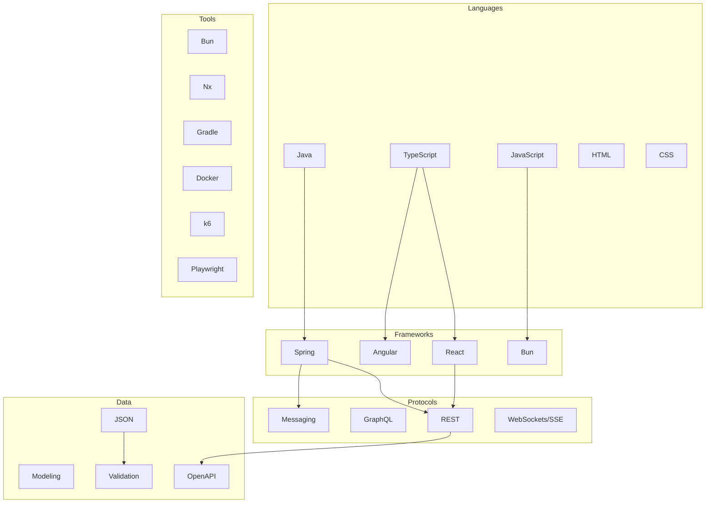
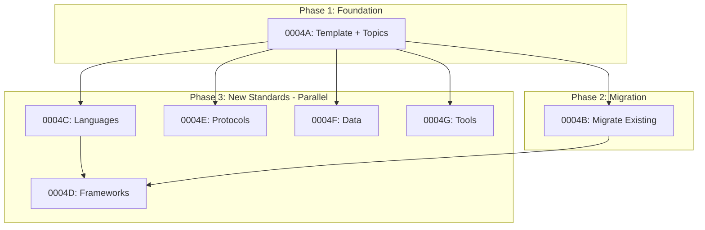

# 0004_standards-restructure

**Status:** DRAFT

---

## Overview

Restructure the standards section from backend/frontend organization to a technology-agnostic taxonomy: languages, frameworks, protocols-transports, data, and tools. Migrate existing Java and React standards to new structure and establish processes for sourcing best practices from authoritative references.

**Related Plans:**
- `0004A_standards-template.md` - Create unified template and cross-cutting topics
- `0004B_standards-migration.md` - Migrate existing Java/React standards
- `0004C_standards-languages.md` - Create language standards (Java, TypeScript, JavaScript, HTML, CSS)
- `0004D_standards-frameworks.md` - Create framework standards (Spring, React, Angular, Bun)
- `0004E_standards-protocols.md` - Create protocol standards (REST, GraphQL, messaging, WebSockets/SSE)
- `0004F_standards-data.md` - Create data standards (JSON, modeling, validation, OpenAPI)
- `0004G_standards-tools.md` - Create tool standards (Bun, Nx, Gradle, Docker, k6, Playwright)

## Goals

1. Replace backend/frontend taxonomy with technology-focused categories
2. Create reusable template ensuring consistency across all standards
3. Define cross-cutting topics that apply to each technology
4. Establish executable process for sourcing from authoritative references
5. Create a "team of experts" - each standard embodies expert knowledge

## Non-Goals

- Creating standards for technologies not listed (future additions)
- Defining organization-specific conventions (those go in project CLAUDE.md)
- Replacing ADRs or other documentation types

---

## Architecture

### New Directory Structure

```
content/standards/
├── README.md                          # Index of all categories
├── TEMPLATE.md                        # Master template for new standards
├── languages/
│   ├── README.md
│   ├── java.md
│   ├── typescript.md
│   ├── javascript.md
│   ├── html.md
│   └── css.md
├── frameworks/
│   ├── README.md
│   ├── spring.md
│   ├── react.md
│   ├── angular.md
│   └── bun.md
├── protocols-transports/
│   ├── README.md
│   ├── rest.md
│   ├── graphql.md
│   ├── messaging.md
│   └── websockets-sse.md
├── data/
│   ├── README.md
│   ├── json.md
│   ├── data-modeling.md
│   ├── data-validation.md
│   └── openapi.md
└── tools/
    ├── README.md
    ├── bun.md
    ├── nx.md
    ├── gradle.md
    ├── docker.md
    ├── k6.md
    └── playwright.md
```

### Category Relationships



### Cross-Cutting Topics

Each standard covers these topics where applicable:

| Topic | Applies To | Description |
|-------|------------|-------------|
| Architecture | Languages, Frameworks | Structure, layering, organization |
| Conventions | All | Naming, formatting, idioms |
| Error Handling | Languages, Frameworks, Protocols | Error structures, propagation |
| Testing | Languages, Frameworks, Tools | Test patterns by level |
| Observability | Frameworks, Protocols | Logging, metrics, tracing |
| Validation | Languages, Protocols, Data | Input validation patterns |
| Resiliency | Frameworks, Protocols | Circuit breakers, retries, timeouts |
| Security | Languages, Frameworks, Protocols | Auth, sanitization, headers |
| Performance | All | Optimization patterns |

---

## Subplan Summary

| Subplan | Purpose | Dependencies |
|---------|---------|--------------|
| 0004A | Template + topics | None |
| 0004B | Migrate existing | 0004A |
| 0004C | Languages | 0004A |
| 0004D | Frameworks | 0004A, 0004B, 0004C |
| 0004E | Protocols | 0004A |
| 0004F | Data | 0004A |
| 0004G | Tools | 0004A |

---

## Authoritative Sources Strategy

### Source Priority

1. **Official Documentation** - Language/framework official docs
2. **Official Style Guides** - Google, Airbnb, etc.
3. **RFCs/Specifications** - For protocols and data formats
4. **Recognized Expert Sources** - Martin Fowler, ThoughtWorks, etc.

### Research Process

For each technology standard:

1. **Identify official docs URL**
2. **Search for official style guide**
3. **Find specification/RFC if applicable**
4. **Extract key patterns and anti-patterns**
5. **Synthesize into template format**

See subplans for specific URLs and extraction steps.

---

## Files Summary

| Action | File | Purpose |
|--------|------|---------|
| CREATE | `content/standards/TEMPLATE.md` | Master template |
| CREATE | `content/standards/README.md` | Category index |
| CREATE | `content/standards/languages/` | Language standards |
| CREATE | `content/standards/frameworks/` | Framework standards |
| CREATE | `content/standards/protocols-transports/` | Protocol standards |
| CREATE | `content/standards/data/` | Data standards |
| CREATE | `content/standards/tools/` | Tool standards |
| DELETE | `content/standards/backend/` | After migration |
| DELETE | `content/standards/frontend/` | After migration |

---

## Testing Strategy

### Automated Tests

| Type | What It Tests | Command |
|------|---------------|---------|
| Unit | Template validation script | `bun test tests/standards/` |
| Integration | All standards conform to template | `bun run validate-standards` |

### Manual Validation

1. Review each migrated standard preserves original intent
2. Verify new standards follow template structure
3. Confirm cross-cutting topics are consistently applied
4. Check all authoritative sources are cited

---

## Dependency Graph



**Parallel Opportunities:**
- After 0004A: Languages, Protocols, Data, Tools can run in parallel
- Frameworks depends on Languages (for Java→Spring, TS→React/Angular)

**Sequential Requirements:**
- Migration (0004B) before Frameworks to preserve React/Spring content
- Template (0004A) before all others

---

## Checklist

- [ ] Subplan 0004A complete (Template)
- [ ] Subplan 0004B complete (Migration)
- [ ] Subplan 0004C complete (Languages)
- [ ] Subplan 0004D complete (Frameworks)
- [ ] Subplan 0004E complete (Protocols)
- [ ] Subplan 0004F complete (Data)
- [ ] Subplan 0004G complete (Tools)
- [ ] Old backend/frontend directories removed
- [ ] All standards validated against template

---

*Plan created with agent-kit. Execute with `/implement-plan`.*
