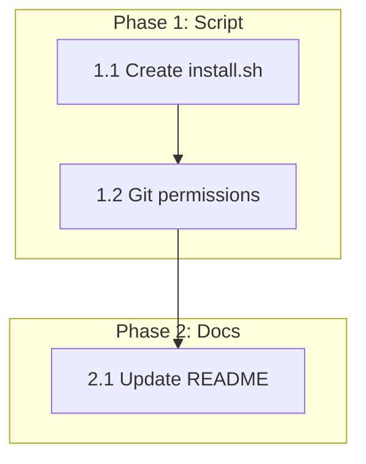

# 0005_install-script

**Status:** COMPLETE

---

## Overview

Create the missing `install.sh` script that the README references. The script bootstraps agent-kit installation by delegating to `npx agent-kit init` with preset support.

## Goals

1. Create `install.sh` that works with the documented curl command
2. Support preset flags (`--preset`, `--all`, `--yes`)
3. Update README.md to reflect actual CLI capabilities

## Non-Goals

- Interactive bash menu (use `ak init` presets instead)
- Windows PowerShell support (Unix bash only)
- Custom GitHub repo support (forks)
- Updating existing installations (`ak update` handles this)

## References

**Existing Implementation:**
- `src/cli/commands/init.ts` - Init command with preset support
- `src/types/presets.ts` - Available presets

---

## Architecture

```
┌─────────────────┐     ┌─────────────────┐     ┌─────────────────┐
│  curl install.sh│────►│   install.sh    │────►│ npx agent-kit   │
│                 │     │  (bootstrap)    │     │     init        │
└─────────────────┘     └─────────────────┘     └─────────────────┘
                              │
                              ▼
                        ┌─────────────────┐
                        │ Parse flags:    │
                        │ --all → --preset full
                        │ --preset X      │
                        │ --yes           │
                        └─────────────────┘
```

**Flag Mapping:**

| install.sh Flag | Passed to ak init |
|-----------------|-------------------|
| `--all` | `--preset full --yes` |
| `--preset X` | `--preset X` |
| `--yes` / `-y` | `--yes` |
| (none) | (defaults to standard) |

---

## Phase 1: Create Install Script

**Prereqs:**
- None

### 1.1 Create install.sh

**Files:**
- CREATE: `install.sh`

**Implementation:**

```bash
#!/usr/bin/env bash
# install.sh - Bootstrap agent-kit installation
# Usage: curl -fsSL https://raw.githubusercontent.com/dopsonbr/agent-kit/main/install.sh | bash

set -euo pipefail

# Colors for output
RED='\033[0;31m'
GREEN='\033[0;32m'
YELLOW='\033[1;33m'
NC='\033[0m' # No Color

info() { echo -e "${GREEN}▸${NC} $1"; }
warn() { echo -e "${YELLOW}▸${NC} $1"; }
error() { echo -e "${RED}✗${NC} $1" >&2; }

# Parse arguments
PRESET=""
YES_FLAG=""

while [[ $# -gt 0 ]]; do
  case $1 in
    --all)
      PRESET="full"
      YES_FLAG="--yes"
      shift
      ;;
    --preset)
      PRESET="$2"
      shift 2
      ;;
    --yes|-y)
      YES_FLAG="--yes"
      shift
      ;;
    *)
      shift
      ;;
  esac
done

# Check for npx
if ! command -v npx &> /dev/null; then
  error "npx not found. Please install Node.js 18+ first."
  echo "  brew install node    # macOS"
  echo "  apt install nodejs   # Ubuntu/Debian"
  exit 1
fi

info "Installing agent-kit..."

# Run installation (avoid eval for security)
if [[ -n "$PRESET" ]]; then
  npx agent-kit@latest init --preset "$PRESET" $YES_FLAG
else
  npx agent-kit@latest init $YES_FLAG
fi

info "Done! Run 'ak help' to get started."
```

**Verification:**

```bash
# Test locally
chmod +x install.sh
./install.sh --help  # Should not error
```

**Commit:** `feat: add install.sh bootstrap script`

---

### 1.2 Make script executable in git

**Files:**
- MODIFY: `install.sh` (git permissions)

**Implementation:**

```bash
git add install.sh
git update-index --chmod=+x install.sh
```

**Verification:**

```bash
git ls-files -s install.sh
# Should show 100755 (executable)
```

**Commit:** (included in 1.1)

---

## Phase 2: Update README

**Prereqs:**
- Phase 1 complete

### 2.1 Fix installation documentation

**Files:**
- MODIFY: `README.md`

**Implementation:**

Update the installation section to:
1. Remove references to "interactive menu" and "groups"
2. Document preset-based installation
3. Show correct flags

**Before:**
```markdown
Interactive menu lets you select from logical groups:

| Group | Includes | Description |
|-------|----------|-------------|
| **Planning** | `create-plan`, `review-plan`... |
```

**After:**
```markdown
### Presets

| Preset | Description |
|--------|-------------|
| `standard` | Core skills for most projects (default) |
| `full` | Everything included |
| `minimal` | Just AGENTS.md |
| `claude` | Optimized for Claude Code |
| `copilot` | Optimized for GitHub Copilot |
| `codex` | Optimized for OpenAI Codex CLI |
| `planning` | Focus on design and docs |
| `review` | Focus on code review |
| `execution` | Focus on autonomous execution |

```bash
# Install with a specific preset
curl -fsSL https://raw.githubusercontent.com/dopsonbr/agent-kit/main/install.sh | bash -s -- --preset claude
```
```

**Verification:**

```bash
# Check markdown renders correctly
cat README.md | head -50
```

**Commit:** `docs: update README with preset-based installation`

---

## Files Summary

| Action | File | Purpose |
|--------|------|---------|
| CREATE | `install.sh` | Bootstrap script for curl installation |
| MODIFY | `README.md` | Update installation docs to match reality |

---

## Testing Strategy

### Automated Tests

No automated tests for `install.sh` — bash scripts are validated manually.
The script delegates to `npx agent-kit init` which is tested in `tests/cli/init.test.ts`.

**Note:** Full E2E testing requires npm publish. Manual validation is primary.

### Manual Validation

1. **Test local script execution:**
   ```bash
   chmod +x install.sh
   ./install.sh --preset minimal --yes
   ```
   **Expected:** Creates `AGENTS.md`, `.ak/config.json` (minimal preset skips `.claude/`)

2. **Test --all flag:**
   ```bash
   ./install.sh --all
   ```
   **Expected:** Installs full preset without prompts

3. **Test error handling:**
   ```bash
   # In a shell without node
   PATH="" ./install.sh
   ```
   **Expected:** Error message about npx not found

4. **Test from GitHub (after merge):**
   ```bash
   curl -fsSL https://raw.githubusercontent.com/dopsonbr/agent-kit/main/install.sh | bash
   ```
   **Expected:** Downloads and runs, installs standard preset

---

## Documentation Updates

| File | Update Required |
|------|-----------------|
| `README.md` | Replace groups/menu with presets |

---

## Dependency Graph



**Sequential Requirements:**
- All tasks are sequential (simple plan)

---

## Rollback Plan

```bash
# Remove install script
git rm install.sh
git revert HEAD  # Revert README changes
```

---

## Checklist

- [x] Phase 1 complete
- [x] Phase 2 complete
- [ ] Manual validation passed (post-merge)
- [x] README reflects reality

---

*Plan created with agent-kit. Execute with `/implement-plan`.*
