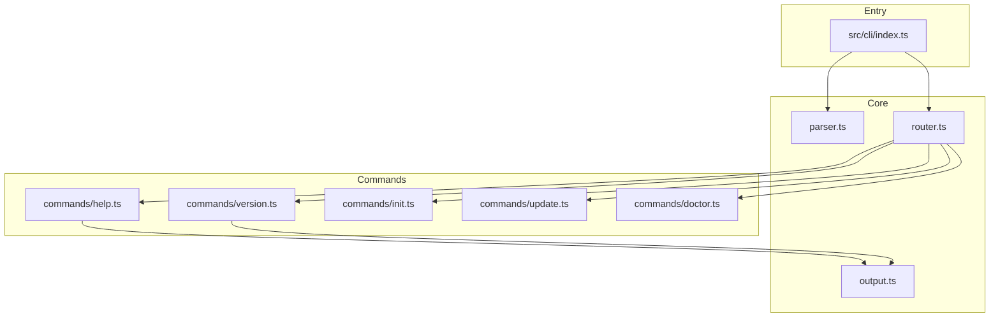
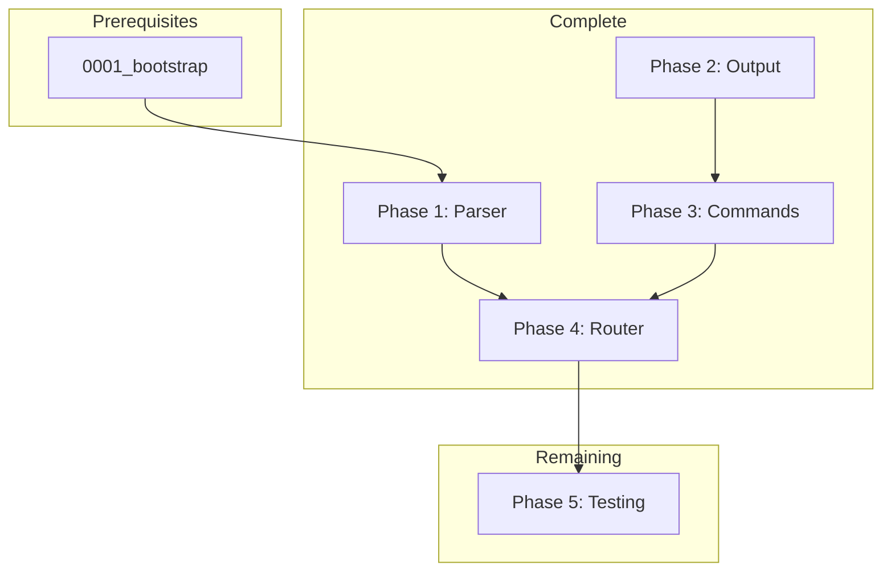

## Archive Information

| Field | Value |
|-------|-------|
| Archived | 2025-12-21 |
| PR | N/A (direct to main) |
| Branch | `main` |
| Commits | 3 commits (Phase 5 execution) |
| Files Changed | 2 files (+71 lines) |

### Implementation Commits

```
1946d33 test(cli): add parser tests
64c4af5 test(cli): add E2E tests
a179e1e docs(plan): mark 0002_cli-core as COMPLETE
```

### Files Changed Summary

| Action | Count | Examples |
|--------|-------|----------|
| Created | 2 | `tests/cli/parser.test.ts`, `tests/cli/e2e.test.ts` |
| Modified | 0 | - |
| Deleted | 0 | - |

### Execution Summary

**Duration:** 2025-12-21 (single session)
**Phases:** 5 phases, 8 tasks total
**Reviews:** 2 checkpoints passed (phase + final)

Phases 1-4 (parser, output, commands, router) were completed in prior work. This execution completed Phase 5 (testing) by adding parser unit tests and CLI E2E tests. Codex CLI provided independent review validation.

### Lessons Learned

**What Went Well:**
- Clear plan structure made execution straightforward
- Parallel test development (parser + E2E) was efficient
- Codex CLI review caught no issues - implementation matched spec

**Recommendations:**
- Consider adding more edge case tests for flag parsing (e.g., `--flag=value` syntax)
- CLI tests could benefit from error case coverage

---

# 0002_cli-core

**Status:** COMPLETE

---

## Overview

Implement the core CLI with argument parsing, output utilities, command routing, and help/version commands. This provides the foundation for all CLI commands.

**Related Plans:**
- `0001_bootstrap` - Project setup this builds on

## Goals

1. Create argument parser for CLI commands
2. Create terminal output utilities (colors, symbols, formatting)
3. Implement help and version commands
4. Create command router
5. Wire up CLI entry point
6. Add high-value tests for parser and commands

## Non-Goals

- Full init implementation (Phase 2 plan) - **stub exists, shows UI only**
- Update command implementation (Phase 3 plan) - **stub exists, shows warning**
- Doctor command enhancement (Phase 4 plan) - **basic checks exist, enhancement deferred**

**Note:** The architecture diagram includes init/update/doctor because stub handlers exist in `src/cli/commands/`. These stubs are routed but not fully functional.

---

## Architecture



---

## Phase 1: Argument Parser

**Prereqs:** Project setup complete
**Blockers:** None

**Status:** COMPLETE

### 1.1 Create Parser Module

**Files:**
- CREATE: `src/cli/parser.ts` - DONE

Parser handles:
- Command extraction from argv
- Flag parsing (--flag, --flag=value, -f)
- Positional arguments
- Special handling for --help and --version

---

## Phase 2: Output Utilities

**Prereqs:** None
**Blockers:** None

**Status:** COMPLETE

### 2.1 Create Output Module

**Files:**
- CREATE: `src/cli/output.ts` - DONE

Provides:
- ANSI color functions (green, red, yellow, blue, cyan, dim, bold)
- Symbols (check, cross, warning, info, arrow)
- Format helpers (success, error, warning, info, title, command, flag)
- printBox() for bordered output

---

## Phase 3: Commands

**Prereqs:** Output utilities
**Blockers:** None

**Status:** COMPLETE

### 3.1 Version Command

**Files:**
- CREATE: `src/cli/commands/version.ts` - DONE

### 3.2 Help Command

**Files:**
- CREATE: `src/cli/commands/help.ts` - DONE

Provides:
- General help with all commands
- Command-specific help (ak help init)
- Skills list (ak help skills)

---

## Phase 4: Router and Entry Point

**Prereqs:** Commands implemented
**Blockers:** None

**Status:** COMPLETE

### 4.1 Command Router

**Files:**
- CREATE: `src/cli/router.ts` - DONE

Routes commands to handlers with error handling.

### 4.2 Entry Point

**Files:**
- CREATE: `src/cli/index.ts` - DONE

Wires parser to router with top-level error handling.

---

## Phase 5: CLI Testing

**Prereqs:** CLI implementation complete
**Blockers:** None

**Status:** COMPLETE

### 5.1 Parser Tests

**Files:**
- CREATE: `tests/cli/parser.test.ts`

**Implementation:**

```typescript
// tests/cli/parser.test.ts
import { describe, it, expect } from 'bun:test'
import { parseArgs } from '../../src/cli/parser'

describe('CLI Argument Parser', () => {
  it('parses command name', () => {
    const args = parseArgs(['node', 'ak', 'init'])
    expect(args.command).toBe('init')
  })

  it('defaults to help when no command', () => {
    const args = parseArgs(['node', 'ak'])
    expect(args.command).toBe('help')
  })

  it('parses boolean flags', () => {
    const args = parseArgs(['node', 'ak', 'init', '--yes'])
    expect(args.flags.yes).toBe(true)
  })

  it('parses flag values', () => {
    const args = parseArgs(['node', 'ak', 'init', '--preset', 'minimal'])
    expect(args.flags.preset).toBe('minimal')
  })

  it('handles --help as help command', () => {
    const args = parseArgs(['node', 'ak', '--help'])
    expect(args.command).toBe('help')
  })

  it('handles --version as version command', () => {
    const args = parseArgs(['node', 'ak', '--version'])
    expect(args.command).toBe('version')
  })

  it('collects positional arguments', () => {
    const args = parseArgs(['node', 'ak', 'help', 'init'])
    expect(args.positional).toEqual(['init'])
  })
})
```

**Verification:**

```bash
bun test tests/cli/parser.test.ts
# Expected: 7 tests passing
```

**Commit:** `test(cli): add parser tests`

### 5.2 CLI E2E Tests

**Files:**
- CREATE: `tests/cli/e2e.test.ts`

**Implementation:**

```typescript
// tests/cli/e2e.test.ts
import { describe, it, expect } from 'bun:test'
import { execSync } from 'child_process'

describe('CLI E2E', () => {
  const run = (args: string) =>
    execSync(`bun run src/cli/index.ts ${args}`, { encoding: 'utf-8' })

  it('shows version with --version', () => {
    const output = run('--version')
    expect(output).toContain('agent-kit')
    expect(output).toMatch(/\d+\.\d+\.\d+/)
  })

  it('shows help with no args', () => {
    const output = run('')
    expect(output).toContain('Usage:')
    expect(output).toContain('init')
  })

  it('shows command help', () => {
    const output = run('help init')
    expect(output).toContain('--preset')
  })

  it('shows skills list', () => {
    const output = run('help skills')
    // Check for skill section, not specific names (may change)
    expect(output).toContain('Skills')
  })
})
```

**Verification:**

```bash
bun test tests/cli/e2e.test.ts
# Expected: 4 tests passing
```

**Commit:** `test(cli): add E2E tests`

---

## Files Summary

| Action | File | Purpose |
|--------|------|---------|
| CREATE | `tests/cli/parser.test.ts` | Parser unit tests |
| CREATE | `tests/cli/e2e.test.ts` | CLI integration tests |

---

## Testing Strategy

### Automated Tests

| Type | What It Tests | Command |
|------|---------------|---------|
| Unit | Argument parsing | `bun test tests/cli/parser.test.ts` |
| E2E | Full CLI commands | `bun test tests/cli/e2e.test.ts` |

### Manual Validation

1. `bun run src/cli/index.ts --version` - shows version
2. `bun run src/cli/index.ts` - shows help
3. `bun run src/cli/index.ts help init` - shows init help with flags
4. `bun run src/cli/index.ts help skills` - lists available skills
5. `bun run src/cli/index.ts unknown` - shows error message

---

## Dependency Graph



**Parallel Opportunities:**
- Parser tests and E2E tests can be developed together

**Sequential Requirements:**
- 0001_bootstrap must be complete
- CLI implementation before tests

---

## Checklist

- [x] Phase 1 complete (parser)
- [x] Phase 2 complete (output)
- [x] Phase 3 complete (commands)
- [x] Phase 4 complete (router)
- [x] Phase 5 complete (testing)
- [x] All tests passing

---

*Plan created with agent-kit. Execute with `/implement-plan`.*
