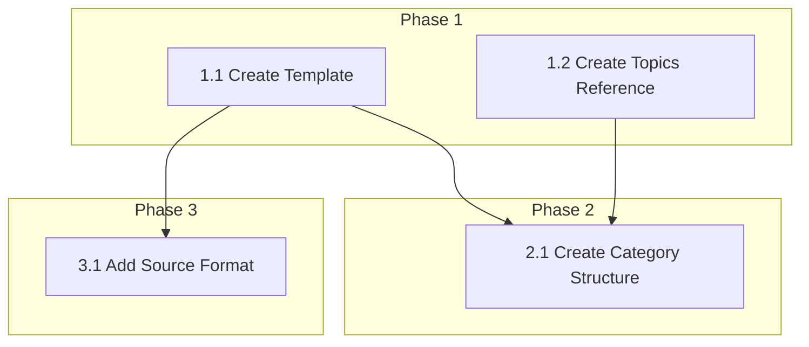

# 0004A_standards-template

**Status:** DRAFT

---

## Overview

Create the unified standards template and define cross-cutting topics that ensure consistency across all technology standards. This is the foundation for all other standards work.

**Related Plans:**
- `0004_standards-restructure.md` - Parent plan

## Goals

1. Create TEMPLATE.md with strict structure for all standards
2. Define cross-cutting topics with applicability matrix
3. Create category README.md files with indexes
4. Establish authoritative source citation format

## Non-Goals

- Creating actual technology standards (those are in sibling subplans)
- Migrating existing content (that's 0004B)

---

## Architecture

### Template Structure

```
# {Technology} Standard

## Metadata
- **Category:** languages | frameworks | protocols-transports | data | tools
- **Authoritative Sources:** [links]
- **Last Updated:** YYYY-MM-DD

## Intent
{Why this standard exists - 2-3 sentences}

## Outcomes
{What following this standard achieves - bullet list}

## Topics

### Architecture (if applicable)
### Conventions
### Error Handling (if applicable)
### Testing (if applicable)
### Observability (if applicable)
### Validation (if applicable)
### Resiliency (if applicable)
### Security (if applicable)
### Performance (if applicable)

## Anti-patterns
{Common mistakes with examples}

## Reference
{Links to example implementations}
```

---

## Phase 1: Create Template

**Prereqs:** None

### 1.1 Create Master Template

**Files:**
- CREATE: `content/standards/TEMPLATE.md`

**Implementation:**

Create template based on existing Java standards structure with metadata additions:

```markdown
# {Technology Name} Standard

## Metadata

| Field | Value |
|-------|-------|
| Category | `languages` \| `frameworks` \| `protocols-transports` \| `data` \| `tools` |
| Authoritative Sources | {List primary sources} |
| Last Updated | {YYYY-MM-DD} |

---

## Intent

{2-3 sentences explaining why this standard exists and what problem it solves.}

## Outcomes

Following this standard ensures:

- {Outcome 1}
- {Outcome 2}
- {Outcome 3}

---

## Topics

{Include only sections relevant to this technology. Each topic follows the same structure:}

### {Topic Name}

#### Patterns

{Show the correct way with code examples}

```{language}
// DO - description
{correct code}
```

#### Anti-patterns

```{language}
// DON'T - description
{incorrect code}
```

---

## Reference

- `{path/to/example}` - {description}
- [{External Resource}]({url}) - {why relevant}
```

**Verification:**

```bash
cat content/standards/TEMPLATE.md | head -50
# Expected: Template content visible
```

**Commit:** `docs(standards): add master template`

---

### 1.2 Create Cross-Cutting Topics Reference

**Files:**
- CREATE: `content/standards/TOPICS.md`

**Implementation:**

Define each topic with description and applicability:

| Topic | Description | Languages | Frameworks | Protocols | Data | Tools |
|-------|-------------|-----------|------------|-----------|------|-------|
| Architecture | Code organization, layering, dependencies | Y | Y | - | Y | - |
| Conventions | Naming, formatting, idioms | Y | Y | Y | Y | Y |
| Error Handling | Error types, propagation, messages | Y | Y | Y | Y | - |
| Testing | Test patterns by level (unit/int/e2e) | Y | Y | Y | Y | Y |
| Observability | Logging, metrics, tracing | - | Y | Y | - | Y |
| Validation | Input validation patterns | Y | Y | Y | Y | - |
| Resiliency | Circuit breakers, retries, timeouts | - | Y | Y | - | - |
| Security | Auth, sanitization, headers | Y | Y | Y | Y | - |
| Performance | Optimization patterns, benchmarking | Y | Y | Y | Y | Y |

**Verification:**

```bash
cat content/standards/TOPICS.md
# Expected: Complete topic matrix
```

**Commit:** `docs(standards): add cross-cutting topics reference`

---

## Phase 2: Create Directory Structure

**Prereqs:** Phase 1

### 2.1 Create Category Directories and READMEs

**Files:**
- CREATE: `content/standards/README.md`
- CREATE: `content/standards/languages/README.md`
- CREATE: `content/standards/frameworks/README.md`
- CREATE: `content/standards/protocols-transports/README.md`
- CREATE: `content/standards/data/README.md`
- CREATE: `content/standards/tools/README.md`

**Implementation:**

Root README:

```markdown
# Standards

Technology standards for building consistent, high-quality software.

## Categories

| Category | Description | Standards |
|----------|-------------|-----------|
| [Languages](./languages/) | Language-specific patterns | Java, TypeScript, JavaScript, HTML, CSS |
| [Frameworks](./frameworks/) | Framework conventions | Spring, React, Angular, Bun |
| [Protocols](./protocols-transports/) | API and communication | REST, GraphQL, Messaging, WebSockets/SSE |
| [Data](./data/) | Data formats and modeling | JSON, Modeling, Validation, OpenAPI |
| [Tools](./tools/) | Build and test tools | Bun, Nx, Gradle, Docker, k6, Playwright |

## Using Standards

1. Find the relevant standard for your technology
2. Follow the Patterns sections for correct implementation
3. Avoid the Anti-patterns sections
4. Reference authoritative sources for deeper understanding

## Creating Standards

Use [TEMPLATE.md](./TEMPLATE.md) for new standards.
See [TOPICS.md](./TOPICS.md) for cross-cutting topic definitions.
```

Each category README follows same pattern with technology list.

**Verification:**

```bash
ls content/standards/*/README.md
# Expected: 6 README files (root + 5 categories)
```

**Commit:** `docs(standards): add category structure with READMEs`

---

## Phase 3: Define Authoritative Source Format

**Prereqs:** Phase 1

### 3.1 Add Source Citation Section to Template

**Files:**
- MODIFY: `content/standards/TEMPLATE.md`

**Implementation:**

Add authoritative sources section with format:

```markdown
## Authoritative Sources

### Primary Sources

| Source | Type | URL |
|--------|------|-----|
| {Official Docs} | Documentation | {url} |
| {Style Guide} | Style Guide | {url} |
| {RFC/Spec} | Specification | {url} |

### How Sources Were Used

- **{Source 1}**: Used for {specific topic}
- **{Source 2}**: Used for {specific topic}

### Source Research Process

1. Search: `"{technology} official documentation"`
2. Search: `"{technology} style guide" site:github.com`
3. Search: `"{technology} best practices" site:thoughtworks.com OR site:martinfowler.com`
4. For protocols: Find RFC number and read specification
```

**Verification:**

```bash
grep -A 20 "Authoritative Sources" content/standards/TEMPLATE.md
# Expected: Source citation format visible
```

**Commit:** `docs(standards): add authoritative source citation format`

---

## Files Summary

| Action | File | Purpose |
|--------|------|---------|
| CREATE | `content/standards/TEMPLATE.md` | Master template |
| CREATE | `content/standards/TOPICS.md` | Cross-cutting topics reference |
| CREATE | `content/standards/README.md` | Root index |
| CREATE | `content/standards/languages/README.md` | Languages index |
| CREATE | `content/standards/frameworks/README.md` | Frameworks index |
| CREATE | `content/standards/protocols-transports/README.md` | Protocols index |
| CREATE | `content/standards/data/README.md` | Data index |
| CREATE | `content/standards/tools/README.md` | Tools index |

---

## Testing Strategy

### Automated Tests

| Type | What It Tests | Command |
|------|---------------|---------|
| Unit | Template has required sections | `bun test tests/standards/template.test.ts` |

### Manual Validation

1. Review TEMPLATE.md has all sections from existing Java standards
2. Verify TOPICS.md applicability matrix is complete
3. Confirm all category READMEs exist and link correctly

---

## Dependency Graph



**Parallel Opportunities:**
- Tasks 1.1 and 1.2 can run in parallel

---

## Checklist

- [ ] Phase 1 complete (Template + Topics)
- [ ] Phase 2 complete (Directory structure)
- [ ] Phase 3 complete (Source format)
- [ ] All files validated

---

*Plan created with agent-kit. Execute with `/implement-plan`.*
