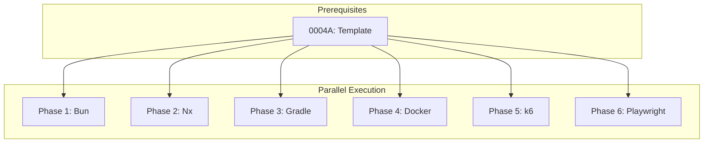

# 0004G_standards-tools

**Status:** DRAFT

---

## Overview

Create tool standards for Bun, Nx, Gradle, Docker, k6, and Playwright. All need full creation from official documentation.

**Related Plans:**
- `0004_standards-restructure.md` - Parent plan
- `0004A_standards-template.md` - Template (prereq)

## Goals

1. Create standards for all 6 tools
2. Source patterns from official documentation
3. Focus on configuration, usage patterns, and best practices
4. Include CI/CD integration patterns

---

## Authoritative Sources by Tool

### Bun (as tool, not runtime)

| Source | Type | URL | Extract |
|--------|------|-----|---------|
| Bun CLI | Official | https://bun.sh/docs/cli | Commands |
| Bun Install | Official | https://bun.sh/docs/cli/install | Package management |
| Bun Scripts | Official | https://bun.sh/docs/cli/run | Script running |

### Nx

| Source | Type | URL | Extract |
|--------|------|-----|---------|
| Nx Docs | Official | https://nx.dev/getting-started/intro | Overview |
| Nx Recipes | Official | https://nx.dev/recipes | Patterns |
| Nx Mental Model | Official | https://nx.dev/concepts/mental-model | Architecture |

### Gradle

| Source | Type | URL | Extract |
|--------|------|-----|---------|
| Gradle User Guide | Official | https://docs.gradle.org/current/userguide/userguide.html | Reference |
| Gradle Best Practices | Official | https://docs.gradle.org/current/userguide/best_practices.html | Patterns |
| Gradle Kotlin DSL | Official | https://docs.gradle.org/current/userguide/kotlin_dsl.html | Kotlin DSL |

### Docker

| Source | Type | URL | Extract |
|--------|------|-----|---------|
| Docker Docs | Official | https://docs.docker.com/ | Reference |
| Dockerfile Best Practices | Official | https://docs.docker.com/develop/develop-images/dockerfile_best-practices/ | Patterns |
| Docker Compose | Official | https://docs.docker.com/compose/ | Compose |

### k6

| Source | Type | URL | Extract |
|--------|------|-----|---------|
| k6 Docs | Official | https://k6.io/docs/ | Reference |
| k6 Examples | Official | https://k6.io/docs/examples/ | Patterns |
| k6 Best Practices | Official | https://k6.io/docs/testing-guides/ | Testing guides |

### Playwright

| Source | Type | URL | Extract |
|--------|------|-----|---------|
| Playwright Docs | Official | https://playwright.dev/docs/intro | Reference |
| Playwright Best Practices | Official | https://playwright.dev/docs/best-practices | Patterns |
| Playwright Test | Official | https://playwright.dev/docs/test-components | Components |

---

## Phase 1: Create Bun Tool Standard

**Prereqs:** 0004A

### 1.1 Create Bun Tool Standard

**Files:**
- CREATE: `content/standards/tools/bun.md`

**Implementation:**

**Research Execution:**
```
WebFetch: https://bun.sh/docs/cli
Prompt: "Extract Bun CLI commands: run, install, test, build. Include common flags."

WebSearch: "bun workspaces monorepo"
Prompt: "Extract Bun workspace patterns for monorepos."
```

**Content Structure:**
```markdown
# Bun Tool Standard

## Metadata
| Field | Value |
|-------|-------|
| Category | `tools` |
| Authoritative Sources | Bun.sh Docs |
| Last Updated | {today} |

## Topics

### Conventions
- bunfig.toml configuration
- Script naming in package.json
- Workspace structure

### Testing
- bun test configuration
- Coverage setup
- Watch mode

### Performance
- Lockfile optimization
- Cache management
- Install speed patterns

### CI/CD Integration
- GitHub Actions setup
- Caching strategies
- Parallel test execution
```

**Commit:** `docs(standards): create tools/bun`

---

## Phase 2: Create Nx Standard

**Prereqs:** 0004A

### 2.1 Create Nx Standard

**Files:**
- CREATE: `content/standards/tools/nx.md`

**Implementation:**

**Research Execution:**
```
WebFetch: https://nx.dev/concepts/mental-model
Prompt: "Extract Nx mental model: projects, targets, executors, generators."

WebFetch: https://nx.dev/recipes/adopting-nx/adding-to-monorepo
Prompt: "Extract Nx monorepo patterns: project structure, implicit dependencies."
```

**Content Structure:**
```markdown
# Nx Standard

## Topics

### Architecture
- Project graph
- Affected commands
- Task pipeline
- Caching

### Conventions
- Project naming
- Tags and constraints
- Generator usage

### Testing
- Affected tests
- E2E project setup
- Code coverage

### CI/CD Integration
- Nx Cloud
- Distributed task execution
- GitHub Actions integration
```

**Commit:** `docs(standards): create tools/nx`

---

## Phase 3: Create Gradle Standard

**Prereqs:** 0004A

### 3.1 Create Gradle Standard

**Files:**
- CREATE: `content/standards/tools/gradle.md`

**Implementation:**

**Research Execution:**
```
WebFetch: https://docs.gradle.org/current/userguide/best_practices.html
Prompt: "Extract Gradle best practices: build logic, performance, reproducibility."

WebSearch: "gradle kotlin dsl best practices"
Prompt: "Extract Kotlin DSL patterns: type-safe accessors, extension functions."
```

**Content Structure:**
```markdown
# Gradle Standard

## Topics

### Architecture
- Build structure (settings.gradle, build.gradle)
- Multi-project builds
- Convention plugins
- Version catalogs

### Conventions
- Kotlin DSL usage
- Plugin configuration
- Dependency management

### Testing
- Test tasks
- Integration test separation
- Testcontainers integration

### Performance
- Build cache
- Configuration cache
- Parallel execution
- Incremental builds

### CI/CD Integration
- Gradle Wrapper
- CI caching
- Build scans
```

**Commit:** `docs(standards): create tools/gradle`

---

## Phase 4: Create Docker Standard

**Prereqs:** 0004A

### 4.1 Create Docker Standard

**Files:**
- CREATE: `content/standards/tools/docker.md`

**Implementation:**

**Research Execution:**
```
WebFetch: https://docs.docker.com/develop/develop-images/dockerfile_best-practices/
Prompt: "Extract Dockerfile best practices: layer caching, multi-stage builds, security."

WebSearch: "docker compose best practices 2024"
Prompt: "Extract Compose patterns: service organization, environment variables, networking."
```

**Content Structure:**
```markdown
# Docker Standard

## Topics

### Conventions
- Dockerfile structure
- Image naming/tagging
- .dockerignore patterns

### Architecture
- Multi-stage builds
- Layer optimization
- Base image selection

### Security
- Non-root users
- Secrets handling
- Image scanning

### Testing
- Healthchecks
- Testcontainers
- Local development

### Performance
- Layer caching
- BuildKit features
- Image size optimization
```

**Commit:** `docs(standards): create tools/docker`

---

## Phase 5: Create k6 Standard

**Prereqs:** 0004A

### 5.1 Create k6 Standard

**Files:**
- CREATE: `content/standards/tools/k6.md`

**Implementation:**

**Research Execution:**
```
WebFetch: https://k6.io/docs/testing-guides/
Prompt: "Extract k6 testing guides: load testing, stress testing, soak testing."

WebFetch: https://k6.io/docs/examples/
Prompt: "Extract k6 examples: HTTP requests, thresholds, checks, groups."
```

**Content Structure:**
```markdown
# k6 Standard

## Topics

### Conventions
- Script organization
- Scenario naming
- Threshold definitions

### Testing
- Load test patterns
- Stress test patterns
- Soak test patterns
- Smoke test patterns

### Architecture
- Shared library code
- Modular test design
- Data parameterization

### Observability
- Metrics collection
- Grafana integration
- Custom metrics

### CI/CD Integration
- Threshold-based gates
- Performance budgets
- Trend analysis
```

**Commit:** `docs(standards): create tools/k6`

---

## Phase 6: Create Playwright Standard

**Prereqs:** 0004A

### 6.1 Create Playwright Standard

**Files:**
- CREATE: `content/standards/tools/playwright.md`

**Implementation:**

**Research Execution:**
```
WebFetch: https://playwright.dev/docs/best-practices
Prompt: "Extract Playwright best practices: locators, assertions, parallelism."

WebFetch: https://playwright.dev/docs/test-components
Prompt: "Extract component testing patterns for React/Angular."
```

**Content Structure:**
```markdown
# Playwright Standard

## Topics

### Conventions
- Test file organization
- Locator strategies
- Test naming

### Architecture
- Page Object Model
- Fixtures
- Global setup/teardown

### Testing
- E2E test patterns
- Component testing
- Visual regression
- Accessibility testing

### Observability
- Trace viewer
- Screenshots on failure
- Video recording

### CI/CD Integration
- Parallel execution
- Sharding
- Retry strategies
- Artifacts handling
```

**Commit:** `docs(standards): create tools/playwright`

---

## Files Summary

| Action | File | Purpose |
|--------|------|---------|
| CREATE | `content/standards/tools/bun.md` | Bun CLI patterns |
| CREATE | `content/standards/tools/nx.md` | Nx monorepo patterns |
| CREATE | `content/standards/tools/gradle.md` | Gradle build patterns |
| CREATE | `content/standards/tools/docker.md` | Docker patterns |
| CREATE | `content/standards/tools/k6.md` | k6 testing patterns |
| CREATE | `content/standards/tools/playwright.md` | Playwright patterns |

---

## Testing Strategy

### Automated Tests

| Type | What It Tests | Command |
|------|---------------|---------|
| Unit | All standards match template structure | `bun test tests/standards/` |

### Manual Validation

1. Verify each standard has complete metadata section
2. Check authoritative sources are cited with URLs
3. Confirm code examples are tool-appropriate
4. Validate anti-patterns section exists where applicable

---

## Dependency Graph



**Parallel Opportunities:**
- All 6 tools can be created in parallel (no dependencies between them)

---

## Checklist

- [ ] Bun tool standard created
- [ ] Nx standard created
- [ ] Gradle standard created
- [ ] Docker standard created
- [ ] k6 standard created
- [ ] Playwright standard created
- [ ] All standards validated against template
- [ ] Official documentation cited

---

*Plan created with agent-kit. Execute with `/implement-plan`.*
