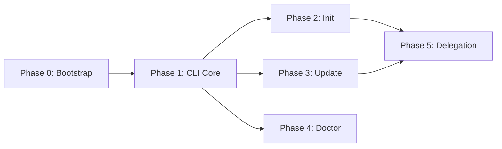

# agent-kit Implementation Plans

This directory contains implementation plans for building agent-kit. Each plan follows the TDD approach defined in our skills.

## Plan Overview

The implementation is broken into phases, each with its own plan:

| Phase | Plan | Status | Description |
|-------|------|--------|-------------|
| 0 | [Bootstrap](./phase-0-bootstrap-plan.md) | 📋 Ready | Project setup, tooling, content migration |
| 1 | [CLI Core](./phase-1-cli-core-plan.md) | 📋 Ready | Basic CLI with help, version |
| 2 | [Init Command](./phase-2-init-plan.md) | 📋 Ready | `ak init` implementation |
| 3 | [Update Command](./phase-3-update-plan.md) | 📋 Ready | `ak update` implementation |
| 4 | [Doctor Command](./phase-4-doctor-plan.md) | 📋 Ready | `ak doctor` implementation |
| 5 | [Delegation](./phase-5-delegation-plan.md) | 📋 Ready | Tool delegation system |

## Execution Order



## How to Execute Plans

Use the skills we're building:

```bash
# Review a plan before execution
/review-plan docs/plans/phase-1-cli-core-plan.md

# Execute a plan autonomously
/implement-plan docs/plans/phase-1-cli-core-plan.md

# Review code after implementation
/review-code --mode branch --base main
```

## Dependencies

- **Runtime**: Bun >= 1.0
- **Testing**: bun:test (built-in)
- **CLI Framework**: Commander.js or custom
- **HTTP**: Built-in fetch
- **File System**: Built-in fs

## Key Decisions

See ADRs in `docs/adrs/` for architectural decisions:

- ADR-0001: Use Bun as runtime
- ADR-0002: Content fetching strategy
- ADR-0003: Multi-format generation approach
